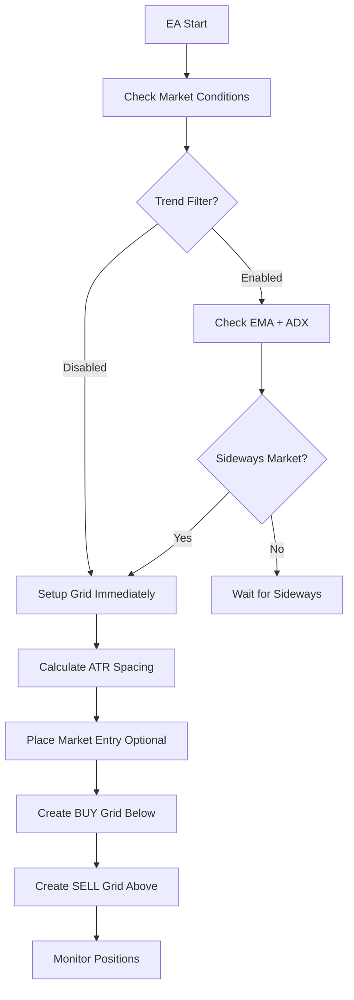

# 🎯 FlexGrid DCA EA v3.0 - Complete Strategy Guide

## 📖 **STRATEGY OVERVIEW**

FlexGrid DCA EA v3.0 implements a **Professional-Grade Dual-Direction Grid Trading System** with **Intelligent Market Analysis**, **Adaptive Risk Management**, và **Multi-Symbol Universal Support**.

---

## 🏗️ **CORE STRATEGY ARCHITECTURE**

### **1. Independent Dual-Grid System**
```
Current Price: 1.10500 (EURUSD Example)

SELL GRID (Above price):        BUY GRID (Below price):
├─ 1.10637 [SELL_LIMIT]        ├─ 1.10363 [BUY_LIMIT]  
├─ 1.10774 [SELL_LIMIT]        ├─ 1.10226 [BUY_LIMIT]
├─ 1.10911 [SELL_LIMIT]        ├─ 1.10089 [BUY_LIMIT]
├─ 1.11048 [SELL_LIMIT]        ├─ 1.09952 [BUY_LIMIT]
└─ 1.11185 [SELL_LIMIT]        └─ 1.09815 [BUY_LIMIT]

🔄 Each direction operates 100% independently
🎯 Immediate market entry: 1 BUY + 1 SELL (optional)
```

### **2. ATR-Based Universal Spacing**
```cpp
// Universal calculation for any symbol
grid_spacing = ATR_H1 * InpATRMultiplier

Examples:
EURUSD: ATR=0.00137 × 1.0 = 137 pips spacing
XAUUSD: ATR=15.50 × 1.0 = 1550 points spacing  
USDJPY: ATR=1.45 × 1.0 = 145 pips spacing

🎯 Automatically adapts to each symbol's volatility
```

### **3. Fibonacci Enhancement (Optional)**
```
When InpUseFibonacciSpacing = true:

Level 1: base_spacing × 0.618 = 85 pips
Level 2: base_spacing × 1.000 = 137 pips  
Level 3: base_spacing × 1.618 = 222 pips
Level 4: base_spacing × 2.618 = 359 pips
Level 5: base_spacing × 4.236 = 580 pips

🎯 Natural market rhythm spacing
```

---

## 🔄 **COMPLETE TRADING CYCLE**

### **Phase 1: Grid Initialization**


### **Phase 2: Normal Trading Operations**
```cpp
OnTick() Logic:
1. Check Profit Targets → Close if reached
2. Update Grid Status → Track fills
3. Smart DCA Check → Expand if needed  
4. Loss Protection → Emergency stop if triggered
5. Place Missing Orders → Maintain grid structure
```

### **Phase 3: Profit Taking & Reset**
```
Profit Target Reached ($4.00 example):
├─ Close ALL positions (BUY + SELL)
├─ Cancel ALL pending orders
├─ Confirm complete cleanup (0 orders remaining)
├─ Reset grid at NEW current price
└─ Start new cycle → Infinite profit loop
```

---

## 🧠 **INTELLIGENT FEATURES**

### **1. Trend Filter System**
```cpp
// EMA Trend Analysis (H1 timeframe)
EMA8, EMA13, EMA21 = Fast trend detection

Strong Uptrend: EMA8 > EMA13 > EMA21 ❌ (Avoid grid setup)
Strong Downtrend: EMA8 < EMA13 < EMA21 ❌ (Avoid grid setup)
Mixed/Sideways: No clear alignment ✅ (Perfect for grid)

// ADX Strength Filter
ADX > 25 = Strong trend ❌ (Wait for weakness)  
ADX < 25 = Weak trend ✅ (Grid-friendly condition)

// Combined Logic
Grid Setup = (ADX < 25) AND (No clear EMA trend)
```

### **2. Smart DCA Expansion**
```cpp
// Early Trigger System
DCA Trigger = floor(InpMaxGridLevels / 2) levels filled

Example with 5 levels:
├─ Trigger point: floor(5/2) = 2 levels filled
├─ Action: Add 5 new STOP orders in counter direction
├─ BUY expansion: SELL STOP orders above current price
├─ SELL expansion: BUY STOP orders below current price
└─ Strategy: Catch momentum while providing support

// Smart Order Types
Normal Grid: LIMIT orders (wait for price to come)
DCA Expansion: STOP orders (follow momentum)
```

### **3. DCA Recovery Mode**
```cpp
// Automatic Activation
if(DCA_Expansion_Triggered && InpUseDCARecoveryMode) {
    // Lower profit targets for faster exit
    target = MathMax(0.0, -InpMaxLossUSD / 2.0);
    // Example: Instead of $4 profit → $0 break-even
}

// Benefits:
- Faster recovery from adverse moves
- Reduced risk after trend detection  
- Smart exit strategy post-DCA
- Automatic reset to normal after success
```

---

## 🎮 **TRADING SCENARIOS**

### **Scenario 1: Perfect Ranging Market**
```
Time: 00:00 - Setup grid at 1.10500
Time: 02:00 - Price → 1.10800 → SELL grid profits → Reset SELL grid  
Time: 04:00 - Price → 1.10200 → BUY grid profits → Reset BUY grid
Time: 06:00 - Price → 1.10700 → SELL grid profits again
Result: 3 profit cycles in 6 hours = $12 total profit

🎯 Best case scenario: Continuous profit cycles
```

### **Scenario 2: Strong Uptrend (DCA Test)**
```
Setup: BUY + SELL grid at 1.10500
Trend: Price rallies to 1.11500 

SELL Grid Performance:
├─ All 5 SELL levels filled quickly → $8 profit → Reset

BUY Grid Performance:  
├─ No fills initially (price above all levels)
├─ Grid resets higher at 1.11500
├─ New BUY levels: 1.11363, 1.11226, etc.
└─ Ready for any pullback

Result: SELL profits + BUY safety repositioned
🎯 Trend-following with protection
```

### **Scenario 3: DCA Expansion (Strong Downtrend)**
```
Setup: Grid at 1.10500
Event: Strong bearish news → Price drops to 1.09800

BUY Grid Status:
├─ Level 1: ✅ FILLED at 1.10363
├─ Level 2: ✅ FILLED at 1.10226  
├─ Level 3: ✅ FILLED at 1.10089 (Trigger point reached!)

DCA Expansion Triggered:
├─ Add 5 BUY STOP orders below 1.09800
├─ Levels: 1.09663, 1.09526, 1.09389, etc.
├─ Strategy: Catch any bounce momentum
├─ Recovery Mode: Target break-even instead of $4 profit

Result: Enhanced position + faster recovery strategy
🎯 Smart DCA with momentum capture
```

### **Scenario 4: Loss Protection Activation**
```
Extreme Market Event: Flash crash or news spike
Total Loss: Approaches -$10 USD limit

EA Response:
├─ Calculate total floating loss
├─ Trigger loss protection mechanism  
├─ Close ALL positions immediately
├─ Cancel ALL pending orders
├─ Set waiting state for spread normalization
└─ Resume normal operations when safe

Result: Limited loss, preserved capital, ready to trade again
🎯 Capital preservation priority
```

### **Scenario 5: Trend Filter in Action**
```
Market Condition: Strong trending market
EMA Status: EMA8 > EMA13 > EMA21 (Strong uptrend)
ADX Reading: 35 (Above 25 threshold)

EA Response:
├─ Trend Filter: "Waiting for sideways market"
├─ No new grid setup until trend weakens
├─ Existing positions: Continue to manage if any
├─ Monitor every hour for condition change
└─ Resume normal operations when ADX < 25

Result: Avoid unfavorable grid conditions
🎯 Market timing intelligence
```

---

## 🛡️ **RISK MANAGEMENT FRAMEWORK**

### **Multi-Layer Protection System**
```
Layer 1: Position Size Control
├─ Fixed lot size (InpFixedLotSize = 0.01)
├─ Predictable risk per position
└─ No progressive/martingale sizing

Layer 2: Grid-Level Risk
├─ Limited grid levels (InpMaxGridLevels = 3-7)  
├─ ATR-based spacing (market-appropriate)
└─ Independent direction management

Layer 3: Account-Level Protection
├─ Loss protection (InpMaxLossUSD = $10)
├─ Immediate position closure when triggered
└─ Capital preservation priority

Layer 4: Market Condition Filters
├─ Spread filtering (symbol-adaptive)
├─ Trend filtering (optional sideways detection)  
├─ Time filtering (optional session control)
└─ Volatility filtering (optional extreme condition avoidance)
```

### **Adaptive Risk by Symbol Type**
```cpp
// Auto-calculated risk profiles:

Major Forex (EURUSD, GBPUSD):
├─ Standard settings work well
├─ Moderate volatility → Standard ATR multiplier
└─ Tight spreads → Conservative spread limits

Gold (XAUUSD):  
├─ Higher volatility → Wider grid spacing
├─ Higher profit targets → Match volatility
├─ Higher spread tolerance → Adaptive limits
└─ Reduced grid levels → Lower frequency

JPY Pairs (USDJPY, EURJPY):
├─ Different price structure → ATR auto-adjusts
├─ Moderate volatility → Standard approach
└─ Moderate spreads → Standard limits

Minor Pairs (AUDCAD, NZDCHF):
├─ Higher volatility → Wider spacing
├─ Higher spreads → Adaptive tolerance  
├─ Less liquidity → Conservative approach
└─ Lower frequency → Higher targets
```

---

## 📊 **PERFORMANCE EXPECTATIONS**

### **Realistic Targets by Market Condition**

#### **Ranging Markets (70% of time)**
```
Cycle Frequency: 2-6 hours
Profit per Cycle: $3-6 USD
Daily Cycles: 4-12 cycles
Expected Daily: $12-72 USD
Win Rate: 85-95%
Risk: Very Low
```

#### **Trending Markets (20% of time)**
```  
Cycle Frequency: 6-24 hours
Profit per Cycle: $4-10 USD (one direction)
Daily Cycles: 1-4 cycles
Expected Daily: $4-40 USD
Win Rate: 70-85%
Risk: Medium (DCA support)
```

#### **Volatile Markets (10% of time)**
```
Cycle Frequency: 1-4 hours  
Profit per Cycle: $2-8 USD
Daily Cycles: 6-24 cycles
Expected Daily: $12-192 USD
Win Rate: 60-80%  
Risk: Higher (Fast fills, quick reversals)
```

### **Monthly Performance Projections**
```
Conservative Estimate:
├─ Average daily: $20 USD
├─ Monthly (22 trading days): $440 USD
├─ ROI on $1000 account: 44%/month
└─ Max drawdown: <$50 USD

Realistic Estimate:
├─ Average daily: $35 USD  
├─ Monthly: $770 USD
├─ ROI: 77%/month
└─ Max drawdown: <$100 USD

Optimistic Estimate (ideal conditions):
├─ Average daily: $60 USD
├─ Monthly: $1,320 USD  
├─ ROI: 132%/month
└─ Max drawdown: <$150 USD

⚠️ Note: Past performance doesn't guarantee future results
```

---

## 🔧 **STRATEGY CUSTOMIZATION**

### **Conservative Approach (Risk-Averse)**
```cpp
InpFixedLotSize = 0.01              // Minimum risk
InpMaxGridLevels = 3                // Small grid
InpProfitTargetUSD = 3.0            // Quick profits
InpMaxLossUSD = 5.0                 // Tight loss control
InpUseTrendFilter = true            // Wait for favorable conditions  
InpUseDCARecoveryMode = true        // Smart recovery
InpATRMultiplier = 1.2              // Wider spacing

Expected: Lower frequency, higher win rate, minimal risk
```

### **Balanced Approach (Recommended)**
```cpp
InpFixedLotSize = 0.01              // Safe position size
InpMaxGridLevels = 5                // Standard grid  
InpProfitTargetUSD = 4.0            // Balanced targets
InpMaxLossUSD = 10.0                // Reasonable protection
InpUseTrendFilter = true            // Smart timing
InpUseDCARecoveryMode = true        // Recovery support
InpATRMultiplier = 1.0              // Standard spacing

Expected: Good frequency, solid win rate, managed risk
```

### **Aggressive Approach (Performance-Focused)**
```cpp
InpFixedLotSize = 0.02              // Higher exposure
InpMaxGridLevels = 7                // Larger grid
InpProfitTargetUSD = 6.0            // Higher targets  
InpMaxLossUSD = 20.0                // Higher tolerance
InpUseTrendFilter = false           // Trade all conditions
InpUseDCARecoveryMode = true        // Recovery support
InpATRMultiplier = 0.8              // Tighter spacing

Expected: High frequency, good profits, higher risk
```

### **Multi-Symbol Portfolio Approach**
```cpp
// Run multiple instances with different symbols:

EURUSD Instance:
├─ Standard settings
├─ Primary performance driver
└─ Proven reliability

XAUUSD Instance:  
├─ Higher targets ($8-15)
├─ Wider spacing (1.2-1.5x ATR)
├─ Higher loss limits ($25-40)
└─ Volatility-adapted parameters

GBPUSD Instance:
├─ Medium aggression
├─ Standard to tight spacing
├─ Medium targets ($5-8)
└─ Good complement to EURUSD

Combined: Diversified risk, multiple profit streams
```

---

## 📈 **OPTIMIZATION STRATEGIES**

### **Parameter Optimization Workflow**
```
1. Baseline Testing (2 weeks):
   - Default settings on main symbol
   - Document performance metrics
   - Identify optimization opportunities

2. Single Parameter Testing (1 week each):
   - InpMaxGridLevels: 3, 5, 7
   - InpATRMultiplier: 0.8, 1.0, 1.2  
   - InpProfitTargetUSD: 3, 4, 5, 6
   - Document best combinations

3. Multi-Parameter Optimization:
   - Use MT5 Strategy Tester
   - Test best single parameters together
   - Validate on out-of-sample data

4. Advanced Feature Testing:
   - Enable Fibonacci spacing
   - Test trend filter effectiveness
   - Validate DCA recovery mode
   - Document improvements

5. Multi-Symbol Validation:
   - Apply best settings to other symbols
   - Adjust for symbol-specific characteristics
   - Build symbol-specific profiles
```

### **Performance Metrics to Track**
```
Primary Metrics:
├─ Total Return (%)
├─ Max Drawdown (%)  
├─ Profit Factor (>1.5 target)
├─ Win Rate (>70% target)
└─ Recovery Factor (>2.0 target)

Secondary Metrics:
├─ Average Trade Duration
├─ Trades per Day
├─ Largest Winning Trade
├─ Largest Losing Trade
└─ Consecutive Losses

Risk Metrics:
├─ Value at Risk (VaR)
├─ Maximum Exposure
├─ Correlation with Market Events
├─ Stress Test Performance
└─ News Event Impact
```

---

## 🎯 **SUCCESS FACTORS**

### **Critical Success Elements**
```
1. Proper Risk Management:
   ✅ Never risk more than account can handle
   ✅ Use fixed lot sizes consistently
   ✅ Set appropriate loss limits
   ✅ Monitor drawdown carefully

2. Market Timing:
   ✅ Use trend filter during learning phase
   ✅ Avoid major news events initially
   ✅ Trade during active market hours
   ✅ Understand symbol characteristics

3. Parameter Discipline:
   ✅ Start conservative, scale gradually
   ✅ Test thoroughly before going live
   ✅ Don't over-optimize on limited data
   ✅ Maintain consistent settings

4. Monitoring & Maintenance:
   ✅ Daily performance review
   ✅ Weekly parameter assessment
   ✅ Monthly strategy evaluation
   ✅ Continuous improvement mindset
```

### **Common Pitfalls to Avoid**
```
❌ Over-leveraging with large lot sizes
❌ Disabling safety features too early
❌ Changing parameters too frequently
❌ Trading during extreme market events
❌ Ignoring drawdown warnings
❌ Over-optimization on backtests
❌ Running without loss protection
❌ Not understanding market cycles
```

---

## 🚀 **ADVANCED APPLICATIONS**

### **Portfolio Integration**
```
EA as Portfolio Component:
├─ 20-30% allocation to grid trading
├─ Complement trend-following strategies  
├─ Provide steady income stream
├─ Diversify across multiple symbols
└─ Balance risk/return profile
```

### **Institutional Applications**
```
Professional Trading Environment:
├─ Multiple symbol deployment
├─ Risk-adjusted position sizing
├─ Correlation analysis integration
├─ Performance attribution tracking
└─ Regulatory compliance monitoring
```

### **Scaling Strategies**
```
Growth Path:
Month 1-3: Prove concept, single symbol
Month 4-6: Add 2-3 symbols, optimize parameters  
Month 7-12: Full multi-symbol deployment
Year 2+: Institutional-level operations

Capital Scaling:
$1K → $5K: Proven performance phase
$5K → $25K: Multi-symbol expansion
$25K+: Professional deployment
```

---

**🎯 The strategy is designed to be:**
- **Simple enough** for new traders to understand
- **Sophisticated enough** for professional deployment  
- **Flexible enough** for various market conditions
- **Robust enough** for long-term performance

**Ready to revolutionize grid trading! 🚀**

---

*This strategy guide provides the complete framework for understanding and implementing FlexGrid DCA EA v3.0's advanced trading methodology.*
