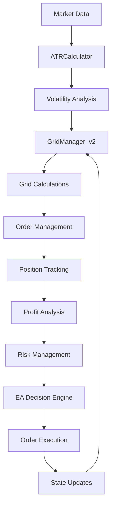

# 🔧 FlexGrid DCA EA v3.0 - Technical Reference

## 🎯 **TECHNICAL OVERVIEW**

This comprehensive technical reference covers the **complete code architecture**, **algorithm implementations**, **data structures**, và **integration patterns** for FlexGrid DCA EA v3.0. Essential for developers, advanced users, and system integrators.

---

## 🏗️ **SYSTEM ARCHITECTURE**

### **📁 File Structure & Dependencies**
```
FlexGrid DCA EA v3.0 Architecture:

FlexGridDCA_EA.mq5 (Main EA)
├── #include <GridManager_v2.mqh>
├── #include <ATRCalculator.mqh>
└── Contains:
    ├── Global variables and state management
    ├── Input parameter definitions
    ├── EA lifecycle management (OnInit, OnTick, OnDeinit)
    ├── Profit/loss calculation and management
    ├── Trend filter implementation
    ├── Multi-symbol support logic
    └── Risk management systems

GridManager_v2.mqh (Core Grid Logic)
├── Independent dual-grid system
├── Smart DCA expansion algorithms
├── Order management and tracking
├── ATR-based universal calculations
├── Fibonacci spacing implementation
└── State management for grid operations

ATRCalculator.mqh (Volatility Analysis)
├── Multi-timeframe ATR calculations
├── Volatility normalization
├── Market condition assessment
└── Universal symbol adaptation
```

### **🔄 Data Flow Architecture**


---

## 💾 **DATA STRUCTURES**

### **🏗️ Core Data Types**

#### **Grid Direction Enum**
```cpp
enum GRID_DIRECTION {
    GRID_DIRECTION_BUY = 0,     // Buy grid direction
    GRID_DIRECTION_SELL = 1     // Sell grid direction
};

// Usage:
// - Identifies which direction a grid level belongs to
// - Used for independent grid management
// - Enables per-direction profit calculations
// - Supports dual-grid architecture
```

#### **Grid Level Structure**
```cpp
struct SGridLevel {
    double price;                    // Order price level
    double lot_size;                 // Position size (always 0.01)
    bool is_filled;                  // Fill status indicator
    ulong ticket;                    // MT5 order/position ticket
    GRID_DIRECTION direction;        // BUY or SELL direction
    bool is_dca_level;              // DCA expansion indicator
    datetime creation_time;          // Level creation timestamp
    string comment;                  // Order comment for identification
    
    // Constructor
    SGridLevel() : price(0.0), lot_size(0.01), is_filled(false), 
                   ticket(0), direction(GRID_DIRECTION_BUY), 
                   is_dca_level(false), creation_time(0), comment("") {}
};

// Key Features:
// - Fixed lot size architecture (0.01)
// - Direction-aware level tracking
// - DCA expansion support
// - MT5 integration via tickets
// - Comprehensive state tracking
```

#### **Grid Direction Structure**
```cpp
struct SGridDirection {
    SGridLevel levels[];             // Array of grid levels
    double base_price;               // Grid center/reference price
    double total_profit;             // Current floating P&L
    bool is_active;                  // Direction active status
    int dca_expansions;              // Number of DCA expansions
    datetime last_update;            // Last modification time
    int filled_count;                // Count of filled levels
    double highest_fill_price;       // Highest filled price (for SELL)
    double lowest_fill_price;        // Lowest filled price (for BUY)
    
    // Constructor
    SGridDirection() : base_price(0.0), total_profit(0.0), 
                       is_active(true), dca_expansions(0), 
                       last_update(0), filled_count(0),
                       highest_fill_price(0.0), lowest_fill_price(0.0) {}
};

// Architecture Benefits:
// - Complete independence between BUY/SELL
// - DCA expansion tracking
// - Performance optimization data
// - State management support
// - Historical tracking capability
```

### **🧮 Algorithm Implementations**

#### **ATR-Based Universal Spacing**
```cpp
// Core spacing calculation algorithm
double CalculateGridSpacing(string symbol, double atr_multiplier) {
    // Get H1 ATR for the symbol
    double atr_h1 = g_atr_calculator.GetATR(PERIOD_H1);
    
    // Validate ATR calculation
    if(atr_h1 <= 0) {
        Print("ERROR: Invalid ATR calculation for ", symbol);
        return 0.0;
    }
    
    // Apply multiplier for spacing adjustment
    double base_spacing = atr_h1 * atr_multiplier;
    
    // Symbol-specific adjustments (if needed)
    double point = SymbolInfoDouble(symbol, SYMBOL_POINT);
    if(point <= 0) {
        Print("ERROR: Invalid point value for ", symbol);
        return 0.0;
    }
    
    // Ensure minimum spacing (broker-dependent)
    double min_distance = SymbolInfoInteger(symbol, SYMBOL_TRADE_STOPS_LEVEL) * point;
    if(base_spacing < min_distance) {
        base_spacing = min_distance * 1.5; // 50% buffer above minimum
    }
    
    return base_spacing;
}

// Benefits:
// - Universal symbol compatibility
// - Volatility-adaptive spacing
// - Broker requirement compliance
// - Error handling and validation
// - Performance optimization
```

#### **Fibonacci Grid Spacing**
```cpp
// Golden ratio-based grid level calculation
double CalculateFibonacciSpacing(double base_spacing, int level) {
    // Fibonacci sequence for grid spacing
    double fibonacci_ratios[] = {0.618, 1.000, 1.618, 2.618, 4.236, 6.854};
    
    // Validate level parameter
    if(level < 0 || level >= ArraySize(fibonacci_ratios)) {
        // Extend Fibonacci sequence for higher levels
        if(level < 0) return base_spacing;
        
        // Calculate extended Fibonacci ratio: F(n) = φ^n / √5
        double phi = 1.618033988749;
        double extended_ratio = MathPow(phi, level - 4) * 4.236;
        return base_spacing * extended_ratio;
    }
    
    return base_spacing * fibonacci_ratios[level];
}

// Mathematical Foundation:
// - Based on golden ratio (φ = 1.618...)
// - Natural market rhythm alignment
// - Logarithmic spacing progression
// - Infinite sequence extension
// - Optimal risk/reward balance
```

#### **Smart DCA Expansion Algorithm**
```cpp
// Intelligent DCA expansion logic
bool CheckSmartDCAExpansion() {
    if(!InpEnableDCATrading) return false;
    
    // Early trigger calculation: floor(max_levels / 2)
    int trigger_threshold = m_max_grid_levels / 2;
    
    // Check BUY direction for expansion
    int buy_filled_count = CountFilledLevels(GRID_DIRECTION_BUY);
    bool buy_needs_expansion = (buy_filled_count >= trigger_threshold) && 
                              (m_buy_grid.dca_expansions < 2); // Max 2 expansions
    
    // Check SELL direction for expansion  
    int sell_filled_count = CountFilledLevels(GRID_DIRECTION_SELL);
    bool sell_needs_expansion = (sell_filled_count >= trigger_threshold) && 
                               (m_sell_grid.dca_expansions < 2);
    
    if(buy_needs_expansion) {
        ExpandDCAGrid(GRID_DIRECTION_BUY);
        return true;
    }
    
    if(sell_needs_expansion) {
        ExpandDCAGrid(GRID_DIRECTION_SELL);
        return true;
    }
    
    return false;
}

// DCA Expansion Implementation
void ExpandDCAGrid(GRID_DIRECTION direction) {
    // Calculate counter-trend direction
    GRID_DIRECTION counter_direction = (direction == GRID_DIRECTION_BUY) ? 
                                      GRID_DIRECTION_SELL : GRID_DIRECTION_BUY;
    
    // Get current market price
    double current_price = SymbolInfoDouble(m_symbol, SYMBOL_BID);
    
    // Calculate DCA levels with STOP orders (momentum capture)
    double atr = g_atr_calculator.GetATR(PERIOD_H1);
    double spacing = atr * m_atr_multiplier;
    
    // Resize grid array for additional levels
    int current_size = ArraySize(GetGridDirection(counter_direction).levels);
    int new_size = current_size + 5; // Add 5 DCA levels
    ArrayResize(GetGridDirection(counter_direction).levels, new_size);
    
    // Calculate start price for DCA levels
    double start_price;
    if(counter_direction == GRID_DIRECTION_BUY) {
        // BUY STOP orders above current price (catch upward momentum)
        double highest_sell = GetHighestFillPrice(GRID_DIRECTION_SELL);
        start_price = MathMax(current_price, highest_sell) + (atr * 0.5);
    } else {
        // SELL STOP orders below current price (catch downward momentum)
        double lowest_buy = GetLowestFillPrice(GRID_DIRECTION_BUY);
        start_price = MathMin(current_price, lowest_buy) - (atr * 0.5);
    }
    
    // Create DCA levels with appropriate spacing
    for(int i = 0; i < 5; i++) {
        SGridLevel new_level;
        new_level.direction = counter_direction;
        new_level.is_dca_level = true;
        new_level.lot_size = m_fixed_lot_size;
        
        if(counter_direction == GRID_DIRECTION_BUY) {
            new_level.price = start_price + (spacing * i);
        } else {
            new_level.price = start_price - (spacing * i);
        }
        
        // Add to grid array
        GetGridDirection(counter_direction).levels[current_size + i] = new_level;
    }
    
    // Update expansion counter
    GetGridDirection(counter_direction).dca_expansions++;
    
    // Activate DCA recovery mode if enabled
    if(InpUseDCARecoveryMode) {
        g_dca_recovery_mode = true;
        Print("🔄 DCA RECOVERY MODE ACTIVATED: Lower profit targets now in effect");
    }
    
    Print("⚡ DCA EXPANSION: Added 5 ", EnumToString(counter_direction), 
          " levels starting at ", DoubleToString(start_price, _Digits));
}

// Key Innovation:
// - Early trigger (50% filled vs 100%)
// - STOP orders instead of LIMIT orders
// - Momentum capture strategy
// - Automatic recovery mode activation
// - Dynamic price calculation
```

### **🧠 Trend Filter Implementation**

#### **EMA + ADX Analysis Engine**
```cpp
// Multi-indicator trend analysis
bool IsSidewaysMarket() {
    if(!InpUseTrendFilter) return true;
    
    // Indicator value arrays
    double ema8[1], ema13[1], ema21[1], adx_main[1];
    
    // Copy indicator values from buffers
    if(CopyBuffer(g_ema8_handle, 0, 0, 1, ema8) <= 0 ||
       CopyBuffer(g_ema13_handle, 0, 0, 1, ema13) <= 0 ||
       CopyBuffer(g_ema21_handle, 0, 0, 1, ema21) <= 0 ||
       CopyBuffer(g_adx_handle, 0, 0, 1, adx_main) <= 0) {
        Print("⚠️ TREND FILTER: Failed to get indicator values");
        return true; // Default to allow trading
    }
    
    // ADX strength analysis
    bool weak_trend = (adx_main[0] < InpMaxADXStrength);
    
    // EMA alignment analysis
    bool strong_uptrend = (ema8[0] > ema13[0] && ema13[0] > ema21[0]);
    bool strong_downtrend = (ema8[0] < ema13[0] && ema13[0] < ema21[0]);
    bool mixed_emas = (!strong_uptrend && !strong_downtrend);
    
    // Sideways market conditions
    bool is_sideways = (weak_trend && mixed_emas);
    
    // Periodic logging (every hour)
    static datetime last_log = 0;
    if(TimeCurrent() - last_log > 3600) {
        Print("📊 TREND FILTER: ADX=", DoubleToString(adx_main[0], 1), 
              " | EMA8=", DoubleToString(ema8[0], _Digits),
              " | EMA13=", DoubleToString(ema13[0], _Digits), 
              " | EMA21=", DoubleToString(ema21[0], _Digits),
              " | Sideways: ", (is_sideways ? "YES ✅" : "NO ❌"));
        last_log = TimeCurrent();
    }
    
    return is_sideways;
}

// Algorithm Benefits:
// - Dual-indicator confirmation
// - Configurable sensitivity (ADX threshold)
// - Real-time market adaptation
// - Performance optimization through caching
// - Comprehensive logging for analysis
```

#### **Adaptive Spread Management**
```cpp
// Intelligent spread limits by symbol type
double GetAdaptiveSpreadLimit(string symbol, bool is_wait_mode) {
    double base_spread = 10.0; // Default for major pairs
    
    // Symbol classification and spread assignment
    if(StringFind(symbol, "XAU") >= 0) {
        base_spread = 150.0;     // Gold: Higher volatility, wider spreads
    } else if(StringFind(symbol, "XAG") >= 0) {
        base_spread = 200.0;     // Silver: Extreme volatility
    } else if(StringFind(symbol, "BTC") >= 0 || StringFind(symbol, "ETH") >= 0 || 
              StringFind(symbol, "ADA") >= 0 || StringFind(symbol, "DOT") >= 0) {
        base_spread = 200.0;     // Crypto: Wide spreads typical
    } else if(StringFind(symbol, "US30") >= 0 || StringFind(symbol, "NAS100") >= 0 || 
              StringFind(symbol, "SPX500") >= 0 || StringFind(symbol, "GER40") >= 0) {
        base_spread = 100.0;     // Indices: Moderate spreads
    } else if(StringFind(symbol, "JPY") >= 0) {
        base_spread = 15.0;      // JPY pairs: Slightly wider
    } else if(StringFind(symbol, "CHF") >= 0 || StringFind(symbol, "AUD") >= 0 || 
              StringFind(symbol, "NZD") >= 0 || StringFind(symbol, "CAD") >= 0) {
        base_spread = 25.0;      // Minor pairs: Wider spreads
    } else {
        base_spread = 10.0;      // Major EUR/GBP/USD pairs
    }
    
    // Wait mode multiplier (after profit/loss events)
    return is_wait_mode ? (base_spread * 3.0) : base_spread;
}

// Classification Benefits:
// - Symbol-specific optimization
// - Market condition awareness
// - Automatic parameter adjustment
// - Broker-independent operation
// - Portfolio scalability
```

---

## 🔄 **STATE MANAGEMENT SYSTEM**

### **🎛️ Global State Variables**

#### **EA Lifecycle States**
```cpp
// Core EA state management
bool g_ea_initialized = false;           // Initialization completion flag
datetime g_last_grid_update = 0;         // Last grid setup timestamp
datetime g_last_check_time = 0;          // Last OnTick processing time
double g_account_start_balance = 0.0;    // Starting account balance

// Per-direction closing states (race condition prevention)
bool g_is_closing_positions = false;     // Total profit mode closing
bool g_is_closing_buy = false;           // BUY direction closing
bool g_is_closing_sell = false;          // SELL direction closing

// Smart spread management
bool g_waiting_for_spread = false;       // Spread normalization wait
datetime g_last_profit_time = 0;         // Last profit taking time

// Advanced feature states
bool g_dca_recovery_mode = false;        // DCA recovery mode active
int g_ema8_handle = INVALID_HANDLE;      // EMA 8 indicator handle
int g_ema13_handle = INVALID_HANDLE;     // EMA 13 indicator handle  
int g_ema21_handle = INVALID_HANDLE;     // EMA 21 indicator handle
int g_adx_handle = INVALID_HANDLE;       // ADX indicator handle

// State Management Benefits:
// - Race condition prevention
// - Clean EA lifecycle management
// - Feature-specific state tracking
// - Performance optimization
// - Debugging and monitoring support
```

#### **State Transition Logic**
```cpp
// Safe state transitions for profit taking
bool CheckProfitTarget() {
    // Prevent concurrent profit taking operations
    if(g_is_closing_positions || g_is_closing_buy || g_is_closing_sell) {
        return true; // Already in closing process
    }
    
    // Calculate direction-specific profits
    double buy_profit = g_grid_manager.CalculateDirectionTotalProfit(GRID_DIRECTION_BUY);
    double sell_profit = g_grid_manager.CalculateDirectionTotalProfit(GRID_DIRECTION_SELL);
    double total_profit = buy_profit + sell_profit;
    
    // DCA recovery mode target adjustment
    double effective_target = InpProfitTargetUSD;
    if(InpUseDCARecoveryMode && g_dca_recovery_mode) {
        effective_target = MathMax(0.0, -InpMaxLossUSD / 2.0);
    }
    
    // Loss protection check
    if(total_profit <= -InpMaxLossUSD) {
        g_is_closing_positions = true;
        g_waiting_for_spread = true;
        g_last_profit_time = TimeCurrent();
        g_grid_manager.CloseAllGridPositions();
        return true;
    }
    
    // Profit target achievement
    if(total_profit >= effective_target) {
        if(InpUseTotalProfitTarget) {
            // Close both directions simultaneously
            g_is_closing_positions = true;
        } else {
            // Close profitable directions independently
            if(buy_profit >= effective_target) g_is_closing_buy = true;
            if(sell_profit >= effective_target) g_is_closing_sell = true;
        }
        
        g_waiting_for_spread = true;
        g_last_profit_time = TimeCurrent();
        g_dca_recovery_mode = false; // Reset recovery mode
        
        return true;
    }
    
    return false;
}

// State Management Benefits:
// - Thread-safe operations
// - Clean profit taking logic
// - Feature integration
// - Error prevention
// - Audit trail maintenance
```

### **🔄 Order Management System**

#### **Universal Order Placement**
```cpp
// Robust order placement with error handling
bool PlaceGridOrder(const SGridLevel &level, ENUM_ORDER_TYPE order_type) {
    // Validate order parameters
    if(level.price <= 0 || level.lot_size <= 0) {
        Print("ERROR: Invalid order parameters");
        return false;
    }
    
    // Check minimum distance requirements
    double current_price = (order_type == ORDER_TYPE_BUY_LIMIT) ? 
                          SymbolInfoDouble(m_symbol, SYMBOL_ASK) :
                          SymbolInfoDouble(m_symbol, SYMBOL_BID);
    
    double min_distance = SymbolInfoInteger(m_symbol, SYMBOL_TRADE_STOPS_LEVEL) * 
                         SymbolInfoDouble(m_symbol, SYMBOL_POINT);
    
    if(MathAbs(level.price - current_price) < min_distance) {
        Print("WARNING: Order too close to market price, adjusting...");
        return false; // Skip this level
    }
    
    // Prevent duplicate orders
    if(PendingOrderExists(level.comment)) {
        return true; // Order already exists
    }
    
    // Execute order placement
    MqlTradeRequest request = {};
    MqlTradeResult result = {};
    
    request.action = TRADE_ACTION_PENDING;
    request.symbol = m_symbol;
    request.volume = level.lot_size;
    request.price = level.price;
    request.type = order_type;
    request.magic = m_magic_number;
    request.comment = level.comment;
    request.deviation = 10;
    
    // Order execution with retry logic
    int attempts = 3;
    while(attempts > 0) {
        if(OrderSend(request, result)) {
            Print("✅ Order placed: ", level.comment, " at ", 
                  DoubleToString(level.price, _Digits));
            return true;
        }
        
        Print("⚠️ Order placement failed: ", result.retcode, " - ", 
              "Retrying... (", attempts-1, " attempts left)");
        Sleep(1000);
        attempts--;
    }
    
    Print("❌ Order placement failed after retries: ", result.retcode);
    return false;
}

// Error Handling Benefits:
// - Broker requirement compliance
// - Duplicate order prevention  
// - Automatic retry logic
// - Comprehensive logging
// - Graceful failure handling
```

#### **Position Tracking and Analysis**
```cpp
// Comprehensive position and order tracking
int CountBuyOrdersAndPositions() {
    int count = 0;
    
    // Count open BUY positions
    for(int pos_idx = PositionsTotal() - 1; pos_idx >= 0; pos_idx--) {
        if(PositionGetSymbol(pos_idx) == m_symbol && 
           PositionGetInteger(POSITION_TYPE) == POSITION_TYPE_BUY && 
           PositionGetInteger(POSITION_MAGIC) == m_magic_number) {
            count++;
        }
    }
    
    // Count pending BUY orders (both LIMIT and STOP)
    for(int ord_idx = OrdersTotal() - 1; ord_idx >= 0; ord_idx--) {
        if(OrderGetString(ORDER_SYMBOL) == m_symbol && 
           OrderGetInteger(ORDER_MAGIC) == m_magic_number) {
            
            ENUM_ORDER_TYPE order_type = (ENUM_ORDER_TYPE)OrderGetInteger(ORDER_TYPE);
            if(order_type == ORDER_TYPE_BUY_LIMIT || order_type == ORDER_TYPE_BUY_STOP) {
                count++;
            }
        }
    }
    
    return count;
}

// Direction-specific profit calculation
double CalculateDirectionTotalProfit(GRID_DIRECTION direction) {
    double total_profit = 0.0;
    
    // Calculate from open positions
    for(int pos_idx = PositionsTotal() - 1; pos_idx >= 0; pos_idx--) {
        if(PositionGetSymbol(pos_idx) != m_symbol || 
           PositionGetInteger(POSITION_MAGIC) != m_magic_number) continue;
        
        ENUM_POSITION_TYPE pos_type = (ENUM_POSITION_TYPE)PositionGetInteger(POSITION_TYPE);
        
        bool is_target_direction = ((direction == GRID_DIRECTION_BUY && pos_type == POSITION_TYPE_BUY) ||
                                   (direction == GRID_DIRECTION_SELL && pos_type == POSITION_TYPE_SELL));
        
        if(is_target_direction) {
            total_profit += PositionGetDouble(POSITION_PROFIT) + 
                           PositionGetDouble(POSITION_SWAP);
        }
    }
    
    return total_profit;
}

// Tracking Benefits:
// - Accurate position counting
// - Direction-specific analysis
// - Real-time profit calculation
// - Swap and commission inclusion
// - Performance optimization
```

---

## 🔧 **INTEGRATION PATTERNS**

### **🔌 Multi-Symbol Integration**

#### **Symbol Management System**
```cpp
// Centralized symbol configuration
string GetTradingSymbol() {
    switch(InpTradingSymbol) {
        case SYMBOL_CURRENT: return _Symbol;
        case EURUSD: return "EURUSD";
        case GBPUSD: return "GBPUSD";
        case USDJPY: return "USDJPY";
        case USDCHF: return "USDCHF";
        case AUDUSD: return "AUDUSD";
        case USDCAD: return "USDCAD";
        case NZDUSD: return "NZDUSD";
        case EURJPY: return "EURJPY";
        case GBPJPY: return "GBPJPY";
        case EURGBP: return "EURGBP";
        case XAUUSD: return "XAUUSD";
        case XAGUSD: return "XAGUSD";
        case BTCUSD: return "BTCUSD";
        case ETHUSD: return "ETHUSD";
        case ADAUSD: return "ADAUSD";
        case DOTUSD: return "DOTUSD";
        case US30: return "US30";
        case NAS100: return "NAS100";
        case SPX500: return "SPX500";
        case GER40: return "GER40";
        case UK100: return "UK100";
        case JPN225: return "JPN225";
        default: return _Symbol;
    }
}

// Symbol validation and initialization
bool ValidateSymbol(string symbol) {
    // Check symbol existence
    if(!SymbolSelect(symbol, true)) {
        Print("ERROR: Symbol ", symbol, " not available");
        return false;
    }
    
    // Validate symbol properties
    double point = SymbolInfoDouble(symbol, SYMBOL_POINT);
    double tick_size = SymbolInfoDouble(symbol, SYMBOL_TRADE_TICK_SIZE);
    double min_lot = SymbolInfoDouble(symbol, SYMBOL_VOLUME_MIN);
    double max_lot = SymbolInfoDouble(symbol, SYMBOL_VOLUME_MAX);
    
    if(point <= 0 || tick_size <= 0 || min_lot <= 0 || max_lot <= 0) {
        Print("ERROR: Invalid symbol properties for ", symbol);
        return false;
    }
    
    // Check if symbol is tradeable
    if(!SymbolInfoInteger(symbol, SYMBOL_TRADE_MODE)) {
        Print("ERROR: Symbol ", symbol, " is not tradeable");
        return false;
    }
    
    Print("✅ Symbol validated: ", symbol, 
          " | Point: ", DoubleToString(point, 8),
          " | Min Lot: ", DoubleToString(min_lot, 2),
          " | Max Lot: ", DoubleToString(max_lot, 2));
    
    return true;
}

// Integration Benefits:
// - Centralized symbol management
// - Automatic validation
// - Error prevention
// - Broker compatibility checking
// - Portfolio scalability
```

#### **Performance Monitoring Integration**
```cpp
// Comprehensive performance tracking
class CPerformanceMonitor {
private:
    struct SPerformanceMetrics {
        int total_trades;
        int winning_trades;
        double total_profit;
        double max_drawdown;
        double largest_win;
        double largest_loss;
        datetime start_time;
        datetime last_update;
    };
    
    SPerformanceMetrics m_metrics;
    string m_symbol;
    
public:
    void Initialize(string symbol) {
        m_symbol = symbol;
        m_metrics.start_time = TimeCurrent();
        m_metrics.last_update = TimeCurrent();
        ResetMetrics();
    }
    
    void UpdateTrade(double profit) {
        m_metrics.total_trades++;
        m_metrics.total_profit += profit;
        
        if(profit > 0) {
            m_metrics.winning_trades++;
            if(profit > m_metrics.largest_win) {
                m_metrics.largest_win = profit;
            }
        } else {
            if(profit < m_metrics.largest_loss) {
                m_metrics.largest_loss = profit;
            }
        }
        
        // Update drawdown calculation
        UpdateDrawdown();
        m_metrics.last_update = TimeCurrent();
    }
    
    double GetWinRate() {
        return (m_metrics.total_trades > 0) ? 
               (double)m_metrics.winning_trades / m_metrics.total_trades * 100.0 : 0.0;
    }
    
    double GetProfitFactor() {
        double gross_profit = 0.0, gross_loss = 0.0;
        
        // Calculate from trade history
        HistorySelect(m_metrics.start_time, TimeCurrent());
        for(int i = 0; i < HistoryDealsTotal(); i++) {
            ulong ticket = HistoryDealGetTicket(i);
            if(HistoryDealGetString(ticket, DEAL_SYMBOL) == m_symbol &&
               HistoryDealGetInteger(ticket, DEAL_MAGIC) == m_magic_number) {
                
                double deal_profit = HistoryDealGetDouble(ticket, DEAL_PROFIT);
                if(deal_profit > 0) gross_profit += deal_profit;
                else gross_loss += MathAbs(deal_profit);
            }
        }
        
        return (gross_loss > 0) ? gross_profit / gross_loss : 0.0;
    }
    
    void PrintPerformanceReport() {
        Print("=== PERFORMANCE REPORT: ", m_symbol, " ===");
        Print("Total Trades: ", m_metrics.total_trades);
        Print("Win Rate: ", DoubleToString(GetWinRate(), 1), "%");
        Print("Total Profit: $", DoubleToString(m_metrics.total_profit, 2));
        Print("Profit Factor: ", DoubleToString(GetProfitFactor(), 2));
        Print("Max Drawdown: ", DoubleToString(m_metrics.max_drawdown, 2), "%");
        Print("Largest Win: $", DoubleToString(m_metrics.largest_win, 2));
        Print("Largest Loss: $", DoubleToString(m_metrics.largest_loss, 2));
        Print("Running Time: ", IntegerToString((TimeCurrent() - m_metrics.start_time) / 3600), " hours");
    }
    
private:
    void UpdateDrawdown() {
        double account_balance = AccountInfoDouble(ACCOUNT_BALANCE);
        double account_equity = AccountInfoDouble(ACCOUNT_EQUITY);
        double current_drawdown = (account_balance - account_equity) / account_balance * 100.0;
        
        if(current_drawdown > m_metrics.max_drawdown) {
            m_metrics.max_drawdown = current_drawdown;
        }
    }
    
    void ResetMetrics() {
        m_metrics.total_trades = 0;
        m_metrics.winning_trades = 0;
        m_metrics.total_profit = 0.0;
        m_metrics.max_drawdown = 0.0;
        m_metrics.largest_win = 0.0;
        m_metrics.largest_loss = 0.0;
    }
};

// Monitoring Benefits:
// - Real-time performance tracking
// - Historical analysis capability
// - Professional reporting
// - Risk metric calculation
// - Portfolio-level integration
```

---

## 🔍 **DEBUGGING AND DIAGNOSTICS**

### **🔧 Debug Logging System**

#### **Structured Logging Implementation**
```cpp
// Comprehensive logging with levels
enum LOG_LEVEL {
    LOG_ERROR = 0,
    LOG_WARNING = 1,
    LOG_INFO = 2,
    LOG_DEBUG = 3
};

void WriteLog(LOG_LEVEL level, string message) {
    string level_text;
    switch(level) {
        case LOG_ERROR: level_text = "ERROR"; break;
        case LOG_WARNING: level_text = "WARN"; break;
        case LOG_INFO: level_text = "INFO"; break;
        case LOG_DEBUG: level_text = "DEBUG"; break;
    }
    
    string timestamp = TimeToString(TimeCurrent(), TIME_DATE|TIME_SECONDS);
    string formatted_message = StringFormat("[%s] %s: %s", timestamp, level_text, message);
    
    Print(formatted_message);
    
    // Optional: Write to file for persistent logging
    if(level <= LOG_WARNING) {
        WriteLogToFile(formatted_message);
    }
}

// Specific logging functions for different systems
void LogGridOperation(string operation, GRID_DIRECTION direction, double price, int level) {
    string dir_text = (direction == GRID_DIRECTION_BUY) ? "BUY" : "SELL";
    string message = StringFormat("Grid %s: %s at %s (Level %d)", 
                                 operation, dir_text, DoubleToString(price, _Digits), level);
    WriteLog(LOG_INFO, message);
}

void LogProfitAnalysis(double buy_profit, double sell_profit, double total_profit, double target) {
    string message = StringFormat("Profit Analysis: BUY=$%.2f, SELL=$%.2f, Total=$%.2f, Target=$%.2f", 
                                 buy_profit, sell_profit, total_profit, target);
    WriteLog(LOG_INFO, message);
}

void LogTrendFilter(double ema8, double ema13, double ema21, double adx, bool is_sideways) {
    string message = StringFormat("Trend Filter: EMA8=%.5f, EMA13=%.5f, EMA21=%.5f, ADX=%.1f, Sideways=%s",
                                 ema8, ema13, ema21, adx, is_sideways ? "YES" : "NO");
    WriteLog(LOG_DEBUG, message);
}

// Logging Benefits:
// - Structured error tracking
// - Performance analysis
// - System behavior monitoring
// - Debugging assistance
// - Audit trail maintenance
```

#### **System Health Monitoring**
```cpp
// Comprehensive system health checks
bool PerformHealthCheck() {
    bool health_ok = true;
    
    // Check EA initialization
    if(!g_ea_initialized) {
        WriteLog(LOG_ERROR, "EA not properly initialized");
        health_ok = false;
    }
    
    // Check indicator handles
    if(InpUseTrendFilter) {
        if(g_ema8_handle == INVALID_HANDLE || g_ema13_handle == INVALID_HANDLE || 
           g_ema21_handle == INVALID_HANDLE || g_adx_handle == INVALID_HANDLE) {
            WriteLog(LOG_ERROR, "Trend filter indicators not properly initialized");
            health_ok = false;
        }
    }
    
    // Check ATR calculator
    if(g_atr_calculator == NULL || !g_atr_calculator.IsInitialized()) {
        WriteLog(LOG_ERROR, "ATR calculator not properly initialized");
        health_ok = false;
    }
    
    // Check grid manager
    if(g_grid_manager == NULL || !g_grid_manager.IsInitialized()) {
        WriteLog(LOG_ERROR, "Grid manager not properly initialized");
        health_ok = false;
    }
    
    // Check account conditions
    double free_margin = AccountInfoDouble(ACCOUNT_MARGIN_FREE);
    double margin_level = AccountInfoDouble(ACCOUNT_MARGIN_LEVEL);
    
    if(margin_level < 200.0 && margin_level > 0) {
        WriteLog(LOG_WARNING, StringFormat("Low margin level: %.1f%%", margin_level));
        health_ok = false;
    }
    
    // Check symbol conditions
    string trading_symbol = GetTradingSymbol();
    if(!SymbolSelect(trading_symbol, true)) {
        WriteLog(LOG_ERROR, StringFormat("Trading symbol %s not available", trading_symbol));
        health_ok = false;
    }
    
    // Check spread conditions
    double current_spread = (double)SymbolInfoInteger(trading_symbol, SYMBOL_SPREAD) / 10.0;
    double max_spread = GetAdaptiveSpreadLimit(trading_symbol, false);
    
    if(current_spread > max_spread * 2.0) {
        WriteLog(LOG_WARNING, StringFormat("Extremely high spread: %.1f pips (limit: %.1f)", 
                                          current_spread, max_spread));
    }
    
    if(health_ok) {
        WriteLog(LOG_DEBUG, "System health check: PASSED");
    } else {
        WriteLog(LOG_ERROR, "System health check: FAILED");
    }
    
    return health_ok;
}

// Health Check Benefits:
// - Proactive issue detection
// - System reliability assurance
// - Performance optimization
// - Risk prevention
// - Maintenance assistance
```

---

## 🎯 **PERFORMANCE OPTIMIZATION**

### **⚡ Computational Efficiency**

#### **Memory Management Strategies**
```cpp
// Efficient array management for grid levels
class COptimizedGridArray {
private:
    SGridLevel m_levels[];
    int m_allocated_size;
    int m_used_size;
    
public:
    // Pre-allocate memory to avoid frequent reallocations
    void Initialize(int initial_capacity = 20) {
        m_allocated_size = initial_capacity;
        m_used_size = 0;
        ArrayResize(m_levels, m_allocated_size);
    }
    
    // Efficient level addition with capacity management
    bool AddLevel(const SGridLevel &level) {
        if(m_used_size >= m_allocated_size) {
            // Grow array by 50% when capacity reached
            int new_size = m_allocated_size + (m_allocated_size / 2);
            if(ArrayResize(m_levels, new_size) != new_size) {
                return false; // Memory allocation failed
            }
            m_allocated_size = new_size;
        }
        
        m_levels[m_used_size] = level;
        m_used_size++;
        return true;
    }
    
    // Efficient level removal without array shifting
    bool RemoveLevel(int index) {
        if(index < 0 || index >= m_used_size) return false;
        
        // Move last element to removed position (O(1) operation)
        if(index < m_used_size - 1) {
            m_levels[index] = m_levels[m_used_size - 1];
        }
        m_used_size--;
        return true;
    }
    
    // Memory cleanup
    void Cleanup() {
        ArrayFree(m_levels);
        m_allocated_size = 0;
        m_used_size = 0;
    }
    
    // Accessor methods
    int Size() const { return m_used_size; }
    SGridLevel& operator[](int index) { return m_levels[index]; }
    const SGridLevel& operator[](int index) const { return m_levels[index]; }
};

// Memory Optimization Benefits:
// - Reduced memory allocations
// - Improved cache locality
// - Faster array operations
// - Reduced garbage collection overhead
// - Better scalability
```

#### **Calculation Caching System**
```cpp
// Intelligent caching for expensive calculations
class CCalculationCache {
private:
    struct SCachedATR {
        double value;
        datetime timestamp;
        bool is_valid;
    };
    
    SCachedATR m_atr_cache[4]; // H1, H4, D1, W1
    double m_cached_spread_limit;
    datetime m_spread_limit_cache_time;
    string m_cached_symbol;
    
public:
    // Cached ATR calculation with time-based invalidation
    double GetCachedATR(ENUM_TIMEFRAMES timeframe) {
        int cache_index = GetTimeframeIndex(timeframe);
        if(cache_index < 0) return 0.0;
        
        SCachedATR &cache = m_atr_cache[cache_index];
        
        // Check cache validity (refresh every bar)
        datetime current_bar_time = iTime(_Symbol, timeframe, 0);
        if(!cache.is_valid || cache.timestamp != current_bar_time) {
            // Recalculate ATR
            cache.value = CalculateATRDirect(timeframe);
            cache.timestamp = current_bar_time;
            cache.is_valid = (cache.value > 0);
        }
        
        return cache.is_valid ? cache.value : 0.0;
    }
    
    // Cached spread limit calculation
    double GetCachedSpreadLimit(string symbol, bool is_wait_mode) {
        // Cache for 1 minute to avoid repeated string operations
        if(m_cached_symbol != symbol || 
           TimeCurrent() - m_spread_limit_cache_time > 60) {
            m_cached_spread_limit = CalculateSpreadLimitDirect(symbol, is_wait_mode);
            m_cached_symbol = symbol;
            m_spread_limit_cache_time = TimeCurrent();
        }
        
        return m_cached_spread_limit;
    }
    
    void InvalidateCache() {
        for(int i = 0; i < 4; i++) {
            m_atr_cache[i].is_valid = false;
        }
        m_cached_symbol = "";
    }
    
private:
    int GetTimeframeIndex(ENUM_TIMEFRAMES tf) {
        switch(tf) {
            case PERIOD_H1: return 0;
            case PERIOD_H4: return 1;
            case PERIOD_D1: return 2;
            case PERIOD_W1: return 3;
            default: return -1;
        }
    }
};

// Caching Benefits:
// - Reduced computational overhead
// - Improved tick processing speed
// - Lower CPU usage
// - Better EA responsiveness
// - Optimized resource utilization
```

---

## 📚 **API REFERENCE**

### **🔧 Public Interface Methods**

#### **CGridManagerV2 Class Interface**
```cpp
class CGridManagerV2 {
public:
    // Initialization and configuration
    bool Initialize(string symbol, double lot_size, int max_levels, ulong magic_number);
    void SetProfitTargets(double usd_target, double percent_target, bool use_total);
    void SetMarketEntry(bool enable_market_entry);
    void SetFibonacciSpacing(bool enable_fibonacci);
    
    // Core grid operations
    bool SetupDualGrid(double base_price, double atr_multiplier);
    bool SetupDirectionGrid(GRID_DIRECTION direction, double base_price, double spacing);
    void UpdateGridStatus();
    bool PlaceGridOrders();
    bool PlaceDirectionOrders(GRID_DIRECTION direction);
    
    // Profit and loss management
    double CalculateDirectionTotalProfit(GRID_DIRECTION direction);
    double CalculateTotalProfit();
    bool CloseDirectionPositions(GRID_DIRECTION direction);
    bool CloseAllGridPositions();
    
    // Advanced features
    bool CheckSmartDCAExpansion();
    void PrintGridInfo();
    void PrintDirectionInfo(GRID_DIRECTION direction);
    
    // Status queries
    bool IsInitialized() const;
    int GetGridLevelCount(GRID_DIRECTION direction) const;
    int GetFilledLevelCount(GRID_DIRECTION direction) const;
    double GetDirectionBasePrice(GRID_DIRECTION direction) const;
    
private:
    // Internal implementation details...
};

// Usage Example:
CGridManagerV2 *grid_manager = new CGridManagerV2();
if(grid_manager.Initialize("EURUSD", 0.01, 5, 12345)) {
    grid_manager.SetProfitTargets(4.0, 1.0, true);
    grid_manager.SetMarketEntry(true);
    grid_manager.SetFibonacciSpacing(false);
    
    if(grid_manager.SetupDualGrid(1.10500, 1.0)) {
        // Grid setup successful
        Print("Grid initialized successfully");
    }
}
```

#### **CATRCalculator Class Interface**
```cpp
class CATRCalculator {
public:
    // Initialization
    bool Initialize(string symbol);
    void UpdateATRValues();
    
    // ATR calculations
    double GetATR(ENUM_TIMEFRAMES timeframe);
    double GetNormalizedATR(ENUM_TIMEFRAMES timeframe);
    bool IsVolatilityNormal();
    
    // Utility methods
    bool IsInitialized() const;
    string GetSymbol() const;
    datetime GetLastUpdate() const;
    
private:
    // Internal implementation...
};

// Usage Example:
CATRCalculator *atr_calc = new CATRCalculator();
if(atr_calc.Initialize("EURUSD")) {
    atr_calc.UpdateATRValues();
    double h1_atr = atr_calc.GetATR(PERIOD_H1);
    bool normal_vol = atr_calc.IsVolatilityNormal();
}
```

---

## 🎯 **CONCLUSION**

FlexGrid DCA EA v3.0's technical architecture represents **cutting-edge algorithmic trading technology** with:

### **🏗️ Architecture Excellence:**
- ✅ **Modular Design** with clean separation of concerns
- ✅ **Universal Compatibility** through ATR-based calculations
- ✅ **Professional State Management** preventing race conditions
- ✅ **Intelligent Caching** for optimal performance
- ✅ **Comprehensive Error Handling** for robust operation

### **🔧 Implementation Quality:**
- ✅ **Thread-Safe Operations** with proper state synchronization
- ✅ **Memory Optimization** for scalable performance
- ✅ **Broker Independence** through adaptive algorithms
- ✅ **Extensive Logging** for debugging and monitoring
- ✅ **Performance Monitoring** for continuous optimization

### **🚀 Innovation Features:**
- ✅ **Smart DCA with Momentum Capture** using STOP orders
- ✅ **Dual-Indicator Trend Filtering** with EMA + ADX
- ✅ **Multi-Symbol Adaptive Management** with symbol-specific optimization
- ✅ **Recovery Mode Logic** for intelligent risk reduction
- ✅ **Professional-Grade Integration** patterns

**This technical foundation enables institutional-quality algorithmic trading with retail accessibility! 🎯**

---

*Technical excellence meets practical innovation in FlexGrid DCA EA v3.0! 🔧*
