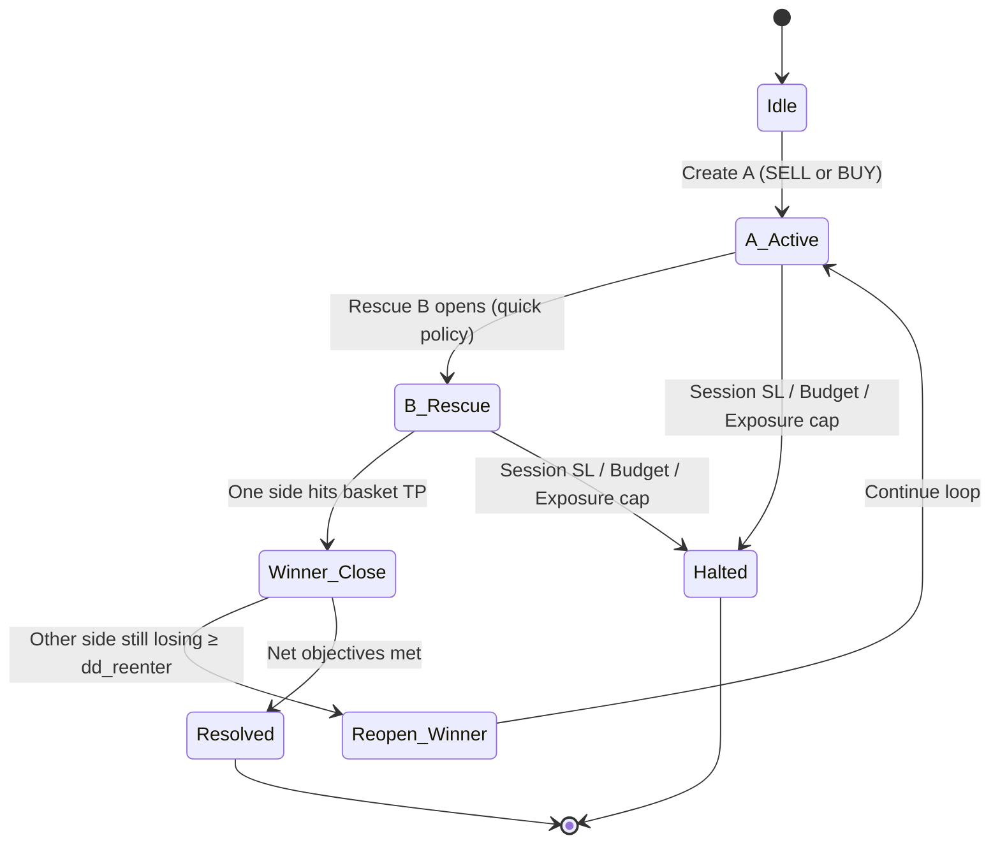
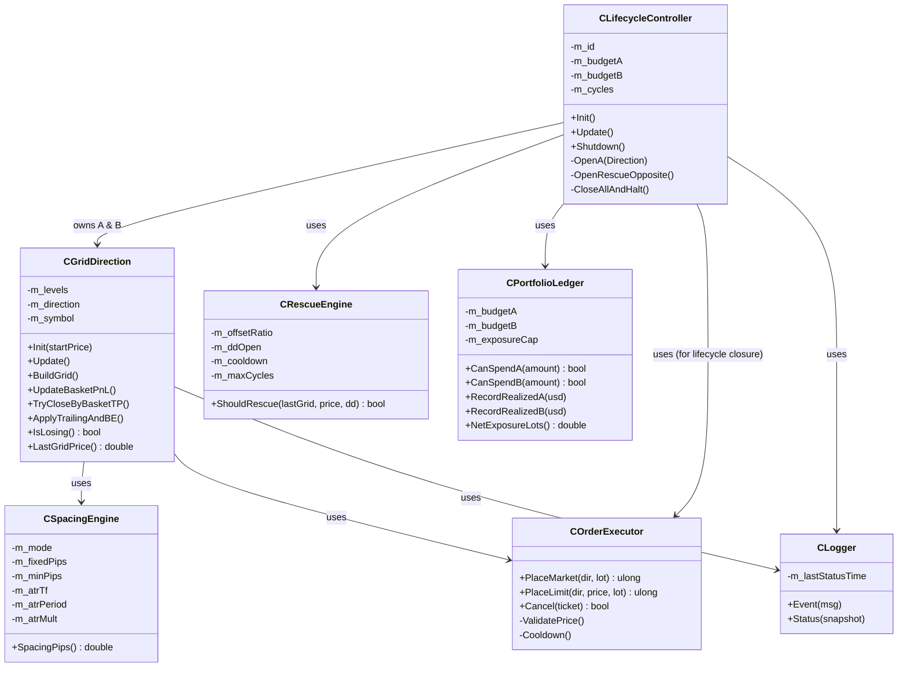

# FLOWCHARTS & DIAGRAMS (Mermaid)

These diagrams capture the control flow, state machine, rescue logic, and class relations. They are implementation-agnostic but assume OOP and multiple instances.

## 1) High-Level EA Flow (OnTick)
```mermaid
flowchart TD
    A[OnTick] --> B{Lifecycle exists?}
    B -- No --> C[Maybe start new Lifecycle (A side)]
    B -- Yes --> D[controller.Update()]
    D --> E[Update A-direction]
    D --> F[Update B-direction]
    E --> G{Basket TP/Trail/BE?}
    F --> H{Basket TP/Trail/BE?}
    G --> I[Apply closes/adjusts]
    H --> I[Apply closes/adjusts]
    D --> J{Rescue conditions?}
    J -- Yes --> K[Open opposite grid]
    J -- No --> L[Maintain]
    K --> L
    L --> M{Limits breached? (budget/exposure/session SL)}
    M -- Yes --> N[Close all & Halt]
    M -- No --> O[Done]
```

## 2) Lifecycle State Machine


## 3) Rescue Decision (Quick Policy)
```mermaid
flowchart LR
    S[Update PnL/Exposure/Fills] --> A{Losing side?}
    A -- No --> X[No action]
    A -- Yes --> B{LastGridBreak + offset?}
    B -- Yes --> C[Open Opposite Grid]
    B -- No --> D{Unrealized DD ≥ dd_open?}
    D -- Yes --> C
    D -- No --> X
    C --> E{Cooldown & Cycles & Exposure OK?}
    E -- No --> X
    E -- Yes --> F[Execute Rescue (market+limits)]
```

## 4) Order Placement & Validation
```mermaid
flowchart TD
    A[Request Place Order] --> B{Cooldown passed?}
    B -- No --> Z[Skip + Log reason]
    B -- Yes --> C{Min distance OK (stops level/freeze)?}
    C -- No --> Z
    C -- Yes --> D{Spread/Slippage OK?}
    D -- No --> Z
    D -- Yes --> E{Duplicate level?}
    E -- Yes --> Z
    E -- No --> F[Send Order]
    F --> G{Broker OK?}
    G -- No --> Z
    G -- Yes --> H[Store ticket + State]
```

## 5) Class Diagram (OOP Structure)


## 6) Multi-Instance Concept
- Multiple lifecycles can exist (future multi-symbol). Each lifecycle is independent and holds its own instances of A/B directions and services; shared services (e.g., Logger) can be passed by reference.
