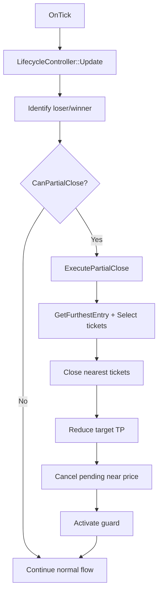

# Partial Close Implementation Plan

## 📋 Overview

**Feature**: Partial Close mechanism để giảm lỗ basket loser khi giá retest, tránh "đóng băng" position trong sideway.

**Problem**: Khi trend mạnh → grid loser tích lũy nhiều orders → lỗ nặng. Winner cứu nhưng phải đợi `total_loss >= InpTargetCycleUSD` mới close → nếu sideway lại, loser bị kẹt với lỗ lớn.

**Solution**: Đóng từng phần positions loser gần giá nhất khi có retest + momentum yếu → giảm average loss, giải phóng margin, rút ngắn TP distance.

---

## 🎯 Design Decisions

### ✅ Confirmed Requirements

1. **PC only for LOSER basket** - Winner đang trailing để cứu, không đóng
2. **No Trend Lockdown integration** - PC hoạt động độc lập
3. **Simplified retest detection** - Không cần `MaxAdversePrice`, dùng furthest entry price
4. **Include commission in PnL** - Sử dụng `InpCommissionPerLot`
5. **Enable/Disable flag** - `InpPcEnabled` để bật/tắt feature

### 🔧 Technical Approach

**Retest Detection (Simplified)**:
```
furthest_entry = max(all_position_entry_prices) for SELL, min() for BUY
retest_distance = |furthest_entry - current_price|
trigger = retest_distance >= pc_retest_atr × ATR
```

**Ticket Selection**:
- Sort positions by distance to current price (nearest first)
- Filter: PnL per ticket >= -tolerance (accept near breakeven)
- Select up to `pc_max_tickets` or `pc_close_fraction` of total lot

**Guard Mechanism**:
- After close → cancel pending in `price ± spacing × pc_pending_guard_mult`
- Set guard flag for `pc_guard_bars` bars
- Block reseed in guard zone until expired or price moves `pc_guard_exit_atr × ATR`

---

## 🏗️ Architecture

### Modified Components

| File | Modifications |
|------|--------------|
| **Types.mqh** | Add PC params to `SParams` struct |
| **Params.mqh** | Add `SParams` mapping logic |
| **RecoveryGridDirection_v2.mq5** | Add 10 input parameters + enable flag |
| **GridBasket.mqh** | Add: `m_partial_realized`, `GetFurthestEntry()`, `HasProfitableTickets()`, `CloseNearestTickets()` |
| **LifecycleController.mqh** | Add: `CanPartialClose()`, `ExecutePartialClose()`, guard state variables |
| **OrderExecutor.mqh** | Add: `CancelPendingByRange()` (if needed) |

### Data Flow



---

## 📝 Implementation Steps

### Phase 1: Types & Parameters (Est: 20 min)

**1.1 Types.mqh - Add to `SParams`**:
```cpp
// Partial Close params
bool   pc_enabled;
double pc_retest_atr;
double pc_slope_hysteresis;
double pc_min_profit_usd;
double pc_close_fraction;
int    pc_max_tickets;
int    pc_cooldown_bars;
int    pc_guard_bars;
double pc_pending_guard_mult;
double pc_guard_exit_atr;
double pc_min_lots_remain;
```

**1.2 EA Main File - Add inputs**:
```cpp
input group "=== Partial Close ==="
input bool   InpPcEnabled           = false;
input double InpPcRetestAtr         = 0.8;
input double InpPcSlopeHysteresis   = 0.0002;
input double InpPcMinProfitUsd      = 1.5;
input double InpPcCloseFraction     = 0.30;
input int    InpPcMaxTickets        = 3;
input int    InpPcCooldownBars      = 10;
input int    InpPcGuardBars         = 6;
input double InpPcPendingGuardMult  = 0.5;
input double InpPcGuardExitAtr      = 0.6;
input double InpPcMinLotsRemain     = 0.20;
```

**1.3 BuildParams() - Map inputs**:
```cpp
g_params.pc_enabled           = InpPcEnabled;
g_params.pc_retest_atr        = InpPcRetestAtr;
g_params.pc_slope_hysteresis  = InpPcSlopeHysteresis;
g_params.pc_min_profit_usd    = InpPcMinProfitUsd;
g_params.pc_close_fraction    = InpPcCloseFraction;
g_params.pc_max_tickets       = InpPcMaxTickets;
g_params.pc_cooldown_bars     = InpPcCooldownBars;
g_params.pc_guard_bars        = InpPcGuardBars;
g_params.pc_pending_guard_mult= InpPcPendingGuardMult;
g_params.pc_guard_exit_atr    = InpPcGuardExitAtr;
g_params.pc_min_lots_remain   = InpPcMinLotsRemain;
```

---

### Phase 2: GridBasket Extension (Est: 45 min)

**2.1 Add private members**:
```cpp
double m_partial_realized;      // Accumulated profit from PC
double m_furthest_entry;        // Track furthest entry for retest
```

**2.2 Constructor init**:
```cpp
m_partial_realized(0.0),
m_furthest_entry(0.0)
```

**2.3 Add methods**:

```cpp
double GetFurthestEntryPrice() const
{
   if(m_total_lot <= 0.0) return 0.0;

   double furthest = 0.0;
   int total = (int)PositionsTotal();

   for(int i = 0; i < total; i++)
   {
      ulong ticket = PositionGetTicket(i);
      if(ticket == 0) continue;
      if(!PositionSelectByTicket(ticket)) continue;
      if(PositionGetString(POSITION_SYMBOL) != m_symbol) continue;
      if(PositionGetInteger(POSITION_MAGIC) != m_magic) continue;

      long type = PositionGetInteger(POSITION_TYPE);
      if((m_direction == DIR_BUY && type != POSITION_TYPE_BUY) ||
         (m_direction == DIR_SELL && type != POSITION_TYPE_SELL))
         continue;

      double entry = PositionGetDouble(POSITION_PRICE_OPEN);

      if(m_direction == DIR_SELL)
         furthest = (furthest == 0.0) ? entry : MathMax(furthest, entry);
      else
         furthest = (furthest == 0.0) ? entry : MathMin(furthest, entry);
   }

   return furthest;
}

struct SPcTicket
{
   ulong  ticket;
   double volume;
   double entry;
   double pnl;
   double distance;
};

bool HasProfitableTickets(double min_profit_usd, int max_tickets, double ref_price)
{
   SPcTicket tickets[];
   int count = 0;

   int total = (int)PositionsTotal();
   for(int i = 0; i < total; i++)
   {
      ulong ticket = PositionGetTicket(i);
      if(ticket == 0) continue;
      if(!PositionSelectByTicket(ticket)) continue;
      if(PositionGetString(POSITION_SYMBOL) != m_symbol) continue;
      if(PositionGetInteger(POSITION_MAGIC) != m_magic) continue;

      long type = PositionGetInteger(POSITION_TYPE);
      if((m_direction == DIR_BUY && type != POSITION_TYPE_BUY) ||
         (m_direction == DIR_SELL && type != POSITION_TYPE_SELL))
         continue;

      count++;
      ArrayResize(tickets, count);
      tickets[count-1].ticket = ticket;
      tickets[count-1].volume = PositionGetDouble(POSITION_VOLUME);
      tickets[count-1].entry = PositionGetDouble(POSITION_PRICE_OPEN);
      tickets[count-1].pnl = PositionGetDouble(POSITION_PROFIT);
      tickets[count-1].distance = MathAbs(tickets[count-1].entry - ref_price);
   }

   if(count == 0) return false;

   // Sort by distance
   for(int i = 0; i < count - 1; i++)
      for(int j = i + 1; j < count; j++)
         if(tickets[i].distance > tickets[j].distance)
         {
            SPcTicket tmp = tickets[i];
            tickets[i] = tickets[j];
            tickets[j] = tmp;
         }

   // Check first max_tickets
   double total_pnl = 0.0;
   int check_count = MathMin(max_tickets, count);
   for(int i = 0; i < check_count; i++)
      total_pnl += tickets[i].pnl;

   return (total_pnl >= min_profit_usd);
}

int CloseNearestTickets(double target_volume, int max_tickets, double min_profit_usd, double ref_price)
{
   SPcTicket tickets[];
   int count = 0;

   // Collect all positions
   int total = (int)PositionsTotal();
   for(int i = 0; i < total; i++)
   {
      ulong ticket = PositionGetTicket(i);
      if(ticket == 0) continue;
      if(!PositionSelectByTicket(ticket)) continue;
      if(PositionGetString(POSITION_SYMBOL) != m_symbol) continue;
      if(PositionGetInteger(POSITION_MAGIC) != m_magic) continue;

      long type = PositionGetInteger(POSITION_TYPE);
      if((m_direction == DIR_BUY && type != POSITION_TYPE_BUY) ||
         (m_direction == DIR_SELL && type != POSITION_TYPE_SELL))
         continue;

      count++;
      ArrayResize(tickets, count);
      tickets[count-1].ticket = ticket;
      tickets[count-1].volume = PositionGetDouble(POSITION_VOLUME);
      tickets[count-1].entry = PositionGetDouble(POSITION_PRICE_OPEN);
      tickets[count-1].pnl = PositionGetDouble(POSITION_PROFIT);
      tickets[count-1].distance = MathAbs(tickets[count-1].entry - ref_price);
   }

   if(count == 0) return 0;

   // Sort by distance (nearest first)
   for(int i = 0; i < count - 1; i++)
      for(int j = i + 1; j < count; j++)
         if(tickets[i].distance > tickets[j].distance)
         {
            SPcTicket tmp = tickets[i];
            tickets[i] = tickets[j];
            tickets[j] = tmp;
         }

   // Close tickets
   double closed_volume = 0.0;
   int closed_count = 0;
   CTrade trade;
   trade.SetExpertMagicNumber(m_magic);

   for(int i = 0; i < count && closed_count < max_tickets; i++)
   {
      if(closed_volume >= target_volume) break;

      // Filter: accept near breakeven or profitable
      if(tickets[i].pnl < -min_profit_usd * 0.5) continue;

      if(trade.PositionClose(tickets[i].ticket))
      {
         m_partial_realized += tickets[i].pnl;
         closed_volume += tickets[i].volume;
         closed_count++;
      }
   }

   return closed_count;
}

double TakePartialCloseProfit()
{
   double val = m_partial_realized;
   m_partial_realized = 0.0;
   return val;
}
```

---

### Phase 3: LifecycleController Logic (Est: 60 min)

**3.1 Add private members**:
```cpp
// Partial Close state
int      m_pc_last_close_bar;
bool     m_pc_guard_active;
double   m_pc_guard_price;
int      m_pc_guard_start_bar;
```

**3.2 Constructor init**:
```cpp
m_pc_last_close_bar(0),
m_pc_guard_active(false),
m_pc_guard_price(0.0),
m_pc_guard_start_bar(0)
```

**3.3 Add helper methods**:

```cpp
int CurrentBarIndex() const
{
   return Bars(m_symbol, PERIOD_CURRENT);
}

int BarsSince(int bar_index) const
{
   return CurrentBarIndex() - bar_index;
}

bool GuardExpired(double price, double atr_points)
{
   if(!m_pc_guard_active) return true;

   if(BarsSince(m_pc_guard_start_bar) >= m_params.pc_guard_bars)
      return true;

   double distance = MathAbs(price - m_pc_guard_price);
   if(distance >= m_params.pc_guard_exit_atr * atr_points)
      return true;

   return false;
}

void ActivatePcGuard(double price)
{
   m_pc_guard_active = true;
   m_pc_guard_price = price;
   m_pc_guard_start_bar = CurrentBarIndex();
}

void CancelPendingAround(double price, double offset_px)
{
   if(offset_px <= 0.0) return;
   if(m_executor == NULL) return;

   double lower = price - offset_px;
   double upper = price + offset_px;

   // Cancel pending in range
   int total = (int)OrdersTotal();
   CTrade trade;
   trade.SetExpertMagicNumber(m_magic);

   for(int i = total - 1; i >= 0; i--)
   {
      ulong ticket = OrderGetTicket(i);
      if(ticket == 0) continue;
      if(!OrderSelect(ticket)) continue;
      if(OrderGetString(ORDER_SYMBOL) != m_symbol) continue;
      if(OrderGetInteger(ORDER_MAGIC) != m_magic) continue;

      double order_price = OrderGetDouble(ORDER_PRICE_OPEN);
      if(order_price >= lower && order_price <= upper)
         trade.OrderDelete(ticket);
   }
}

bool CanPartialClose(CGridBasket *loser, double price, double atr_points)
{
   if(!m_params.pc_enabled) return false;
   if(loser == NULL || !loser.IsActive()) return false;
   if(loser.BasketPnL() >= 0.0) return false;

   // Check guard
   if(m_pc_guard_active && !GuardExpired(price, atr_points))
      return false;

   // Check min lots
   double total_lot = loser.TotalLot();
   if(total_lot <= m_params.pc_min_lots_remain) return false;

   // Check cooldown
   if(BarsSince(m_pc_last_close_bar) < m_params.pc_cooldown_bars)
      return false;

   // Check retest distance
   double furthest = loser.GetFurthestEntryPrice();
   if(furthest == 0.0) return false;

   double retest_dist = MathAbs(furthest - price);
   if(atr_points <= 0.0) atr_points = m_spacing.ToPrice(m_spacing.SpacingPips());
   if(retest_dist < m_params.pc_retest_atr * atr_points)
      return false;

   // Check profitable tickets
   if(!loser.HasProfitableTickets(m_params.pc_min_profit_usd,
                                   m_params.pc_max_tickets,
                                   price))
      return false;

   return true;
}

void ExecutePartialClose(CGridBasket *loser, double price, double spacing_px)
{
   if(loser == NULL) return;

   double total_lot = loser.TotalLot();
   double target_volume = total_lot * m_params.pc_close_fraction;

   // Ensure minimum remains
   if(total_lot - target_volume < m_params.pc_min_lots_remain)
      target_volume = total_lot - m_params.pc_min_lots_remain;

   if(target_volume <= 0.0) return;

   int closed = loser.CloseNearestTickets(target_volume,
                                          m_params.pc_max_tickets,
                                          m_params.pc_min_profit_usd,
                                          price);

   if(closed > 0)
   {
      double realized = loser.TakePartialCloseProfit();

      // Reduce target TP
      if(realized > 0.0)
         loser.ReduceTargetBy(realized);

      // Cancel pending near price
      double guard_offset = spacing_px * m_params.pc_pending_guard_mult;
      CancelPendingAround(price, guard_offset);

      // Activate guard
      ActivatePcGuard(price);
      m_pc_last_close_bar = CurrentBarIndex();

      // Log
      if(m_log != NULL)
      {
         int digits = (int)SymbolInfoInteger(m_symbol, SYMBOL_DIGITS);
         m_log.Event(Tag(), StringFormat("[PartialClose] tickets=%d profit=%.2f price=%s",
                                        closed, realized, DoubleToString(price, digits)));
      }
   }
}
```

**3.4 Integrate into Update()**:

Add after rescue logic, before reseed logic (around line 316):

```cpp
// Partial Close logic
if(loser != NULL && m_params.pc_enabled)
{
   double price_loser = CurrentPrice(loser.Direction());
   if(CanPartialClose(loser, price_loser, atr_points))
   {
      ExecutePartialClose(loser, price_loser, spacing_px);

      // Refresh state after PC
      loser.Update();
   }
}
```

---

### Phase 4: Integration & Testing (Est: 30 min)

**4.1 Compile & Fix Errors**:
- Check all struct member access
- Verify function signatures
- Fix any MQL5 syntax issues

**4.2 Backtest Scenarios**:

| Scenario | Expected Behavior |
|----------|------------------|
| Strong trend → retest | PC triggers, logs shown, lot reduced |
| Sideways after retest | Guard prevents immediate re-open |
| Cooldown active | PC skipped, next opportunity waits |
| Insufficient profitable tickets | PC skipped |
| Guard expires (bars) | Reseed allowed |
| Guard expires (distance) | Reseed allowed |

**4.3 Log Validation**:
```
[PartialClose] tickets=3 profit=2.45 price=1.10234
[PartialClose] guard active, skipping reseed
[PartialClose] guard expired after 6 bars
```

---

## 📊 Testing Checklist

- [ ] PC disabled (`InpPcEnabled = false`) → no PC activity
- [ ] PC enabled, strong trend → no trigger (no retest)
- [ ] Retest detected → PC triggers, tickets closed
- [ ] Guard active → pending cancelled, reseed blocked
- [ ] Guard expires by bars → reseed allowed
- [ ] Guard expires by distance → reseed allowed
- [ ] Cooldown enforced → minimum `pc_cooldown_bars` between PCs
- [ ] Min lots enforced → never close below `pc_min_lots_remain`
- [ ] Commission included in PnL calculation
- [ ] Logs accurate: tickets, profit, price

---

## 🚀 Deployment

1. **Backup current stable version** ✅ (already done: Stable_1.0.0)
2. **Create feature branch**: `git checkout -b feature/partial-close`
3. **Implement phases 1-4**
4. **Test on historical data** (2025.05-2025.07)
5. **Validate against strong trend + sideway periods**
6. **Commit with message**:
   ```
   Add Partial Close feature to reduce loser basket drawdown

   - PC triggers on retest with weakening momentum
   - Closes nearest tickets (max fraction/tickets)
   - Guard mechanism prevents immediate re-opening
   - Enable/disable via InpPcEnabled flag
   ```
7. **Merge to master** after validation

---

## 📌 Notes

- **Conservative defaults**: `InpPcEnabled = false` initially
- **Guard tuning**: Adjust `pc_guard_bars` and `pc_guard_exit_atr` based on backtest
- **Commission**: Set to 0 for Exness live account
- **Future enhancement**: Add slope/momentum check (currently simplified)

---

**Document Version**: 1.0
**Created**: 2025-10-01
**Author**: Recovery Grid Direction v2 Team
