# GRID-DCA EA v2.0 - System Flowchart

## 🔄 **MAIN SYSTEM FLOW**

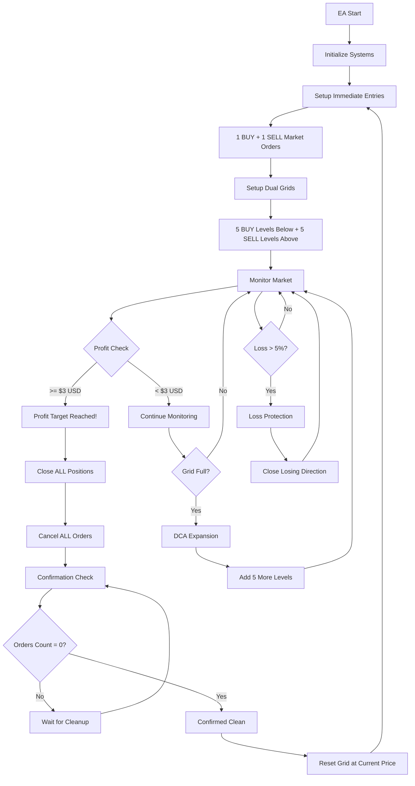

---

## ⚙️ **INITIALIZATION FLOW**

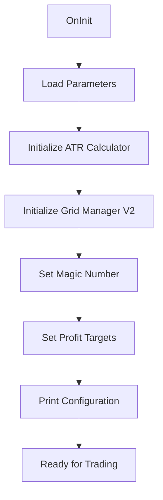

---

## 🎯 **PROFIT TAKING FLOW**

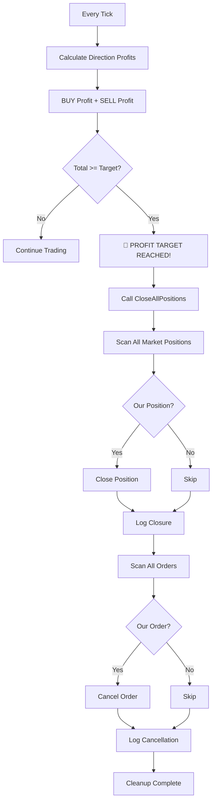

---

## 🔍 **CONFIRMATION CHECK FLOW**

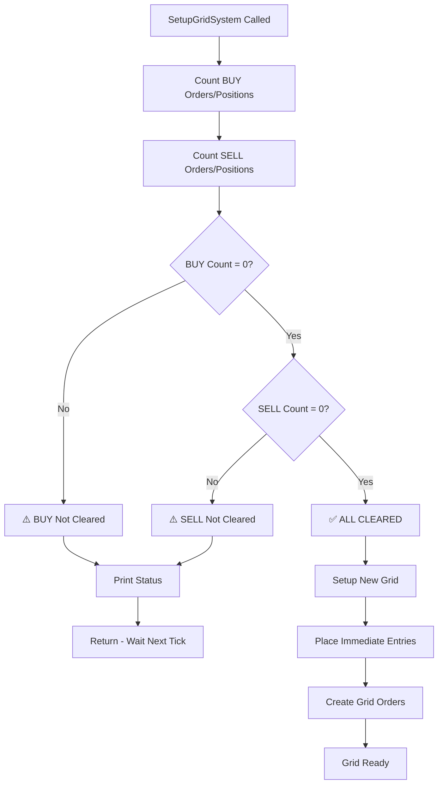

---

## 🏗️ **GRID SETUP FLOW**

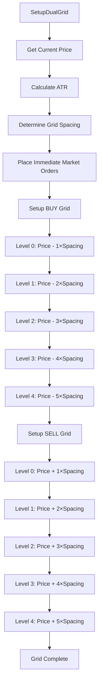

---

## 🔄 **DCA EXPANSION FLOW**

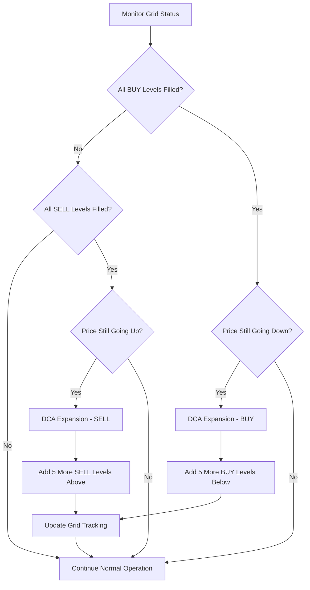

---

## 🛡️ **LOSS PROTECTION FLOW**

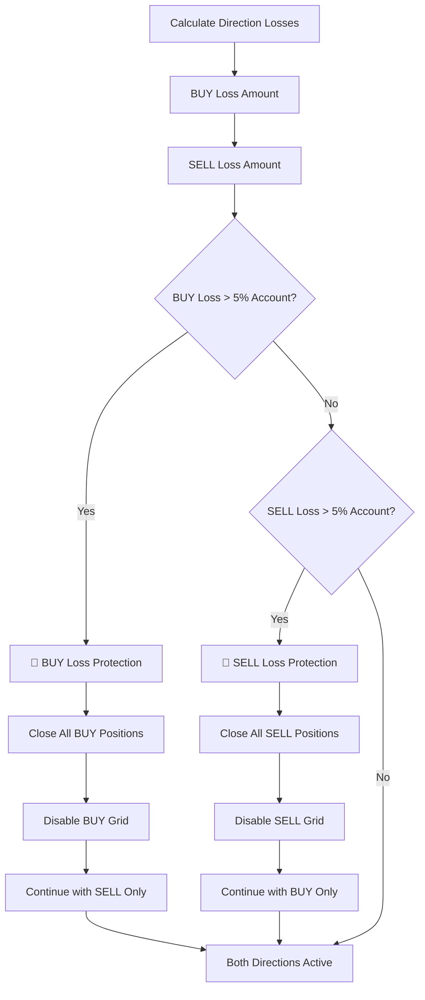

---

## 🎛️ **POSITION MANAGEMENT FLOW**

```mermaid
flowchart TD
    A[Position Detection] --> B{Magic Number Match?}
    B -->|No| C[Skip Position]
    B -->|Yes| D{Comment Match?}
    
    D -->|Grid_*| E[Grid Position]
    D -->|IMMEDIATE_*| F[Immediate Position]
    D -->|Other| G[Unknown Position]
    
    E --> H[Track in Grid System]
    F --> I[Track as Immediate Entry]
    G --> J[Include in General Tracking]
    
    H --> K[Apply Grid Logic]
    I --> L[Apply Immediate Logic]
    J --> M[Apply General Logic]
    
    C --> N[Continue Scan]
    K --> N
    L --> N
    M --> N
```

---

## 📊 **PROFIT CALCULATION FLOW**

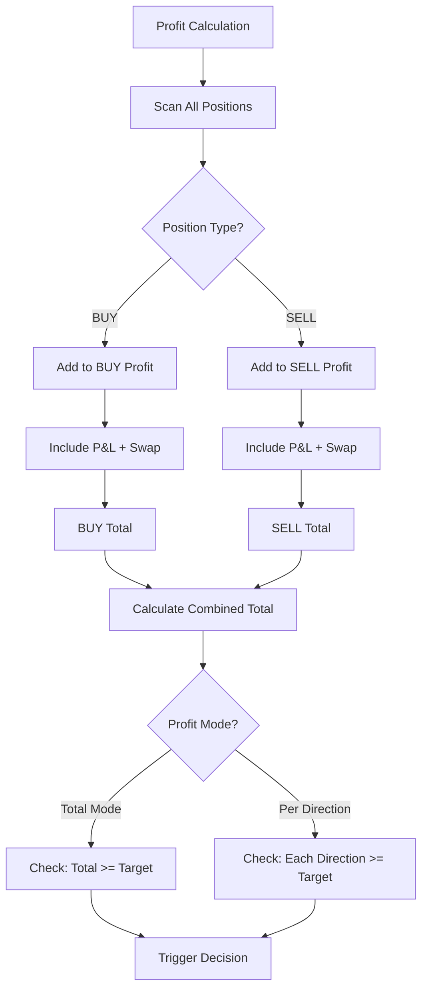

---

## 🔧 **ERROR HANDLING FLOW**

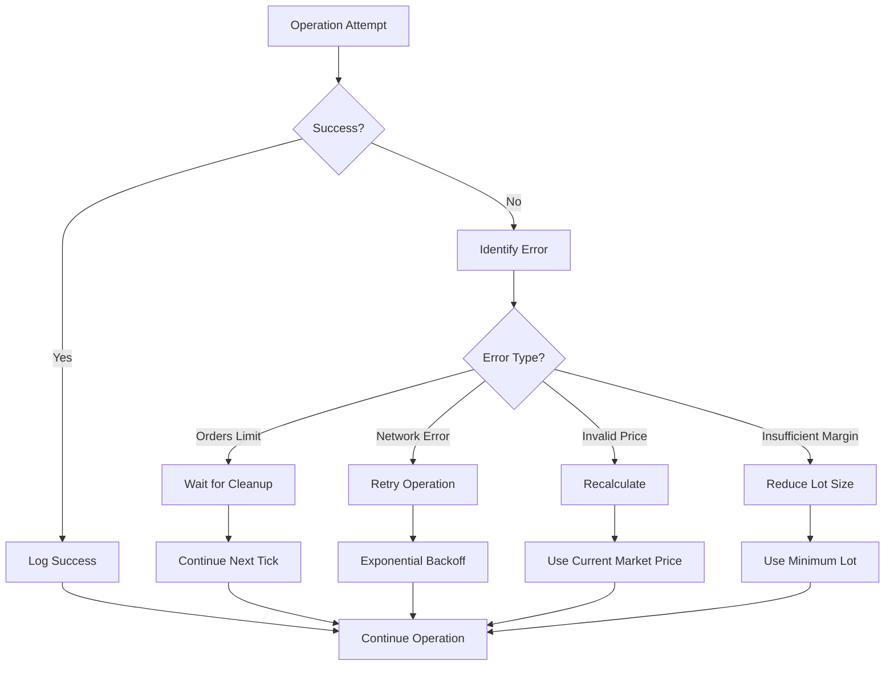

---

## ⏰ **TICK PROCESSING FLOW**

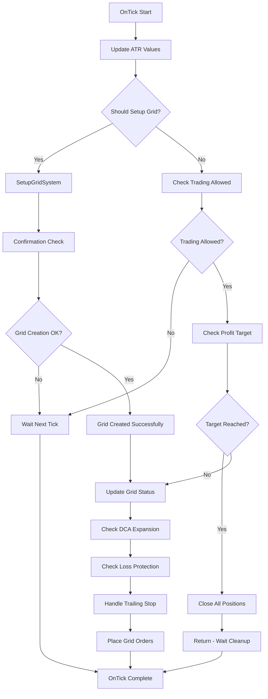

**This flowchart represents the complete operational flow of the GRID-DCA EA v2.0 system! 🎯**
