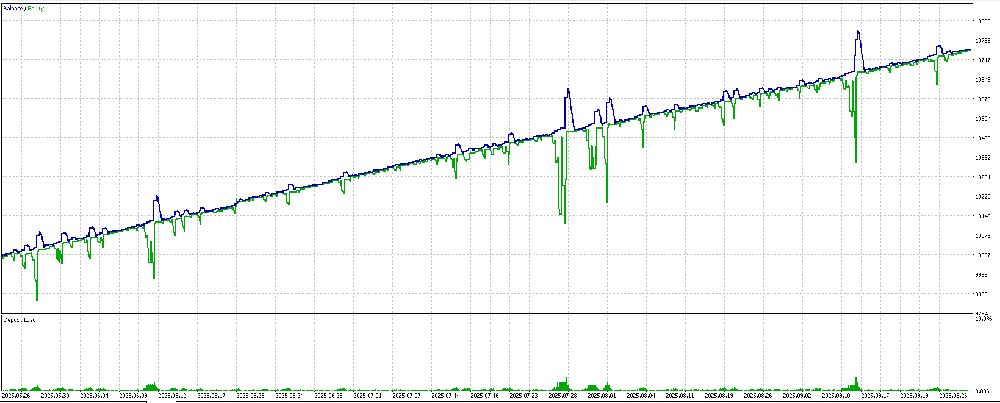
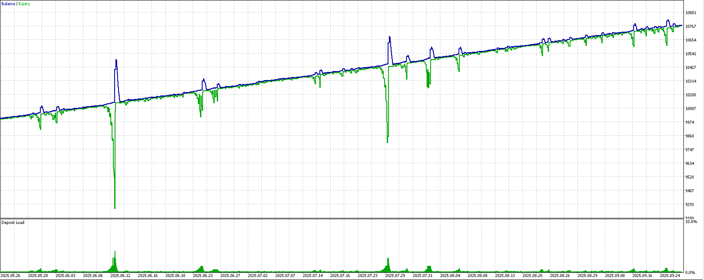
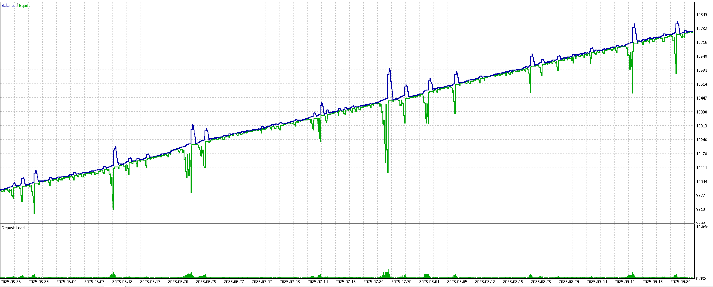
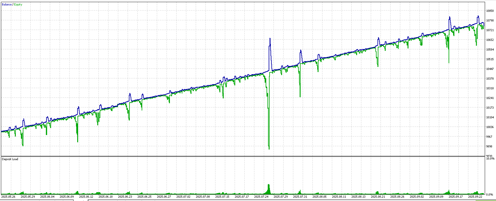
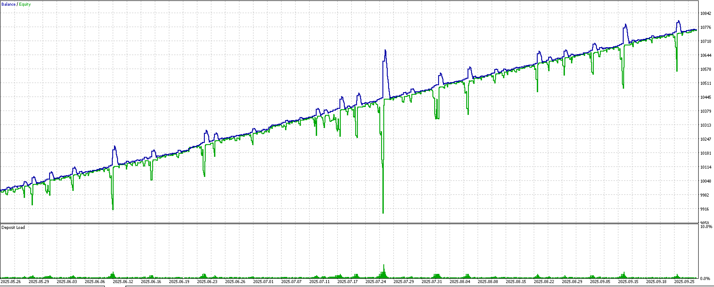
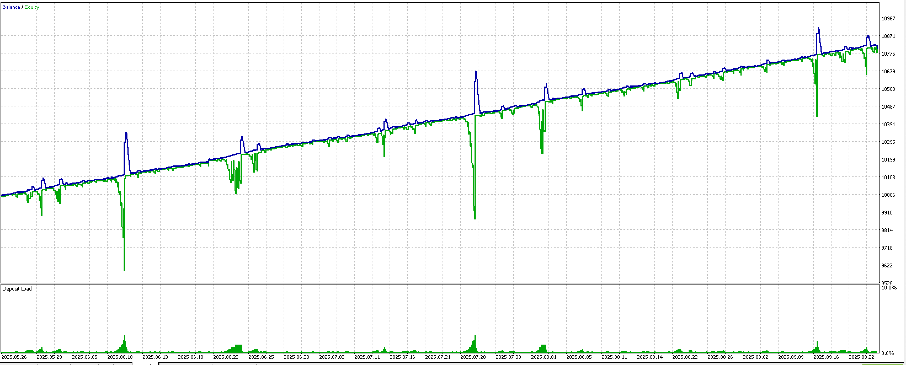
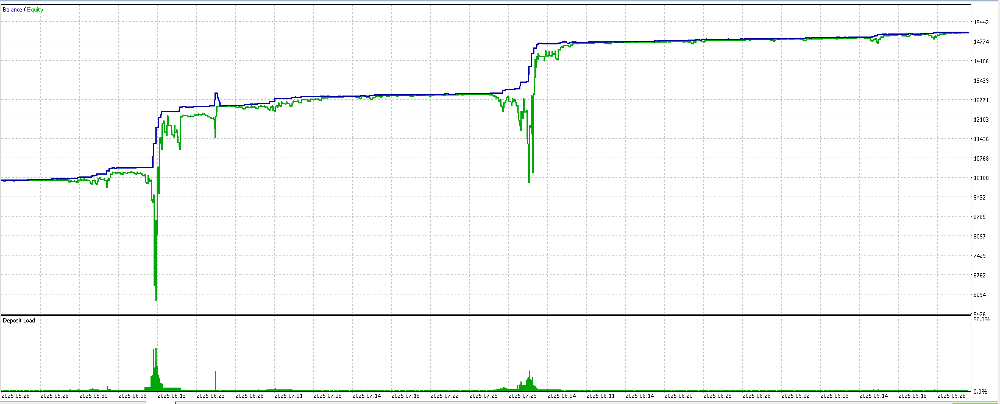
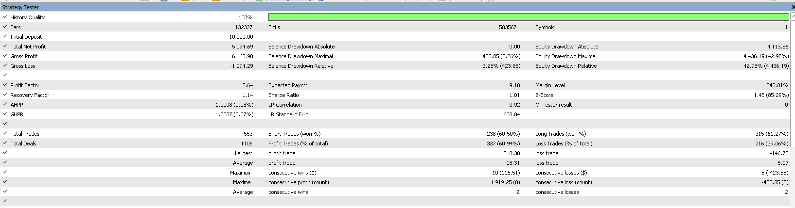

# Preset Configurations for Recovery Grid Direction v2

## 📁 Available Presets

### 01_Baseline.set
**Description**: Both PC and DTS disabled - Pure v2.0 behavior
**Use**: Baseline comparison for testing new features
**Features**:
- ❌ Partial Close: Disabled
- ❌ Dynamic Target Scaling: Disabled

---

### 02_DTS_Default.set
**Description**: DTS enabled with balanced default settings
**Use**: Standard DTS test with all factors enabled
**Features**:
- ❌ Partial Close: Disabled
- ✅ DTS: Enabled (ATR=0.8, Decay=0.01, DD threshold=10)

**Parameters**:
- `InpDtsAtrWeight = 0.8` - Balanced ATR influence
- `InpDtsTimeDecayRate = 0.01` - Standard decay
- `InpDtsDdThreshold = 10.0` - Moderate DD trigger
- `InpDtsMinMultiplier = 0.5` - Can reduce to 50%
- `InpDtsMaxMultiplier = 2.5` - Can increase to 250%

---

### 03_DTS_Conservative.set ⭐ **Recommended First Test**
**Description**: DTS with gentle adjustments
**Use**: Safe testing with minimal deviation from baseline
**Features**:
- ❌ Partial Close: Disabled
- ✅ DTS: Conservative (ATR=0.5, Decay=0.005, DD threshold=15)

**Parameters**:
- `InpDtsAtrWeight = 0.5` - Gentler ATR influence
- `InpDtsTimeDecayRate = 0.005` - Slower decay
- `InpDtsTimeDecayFloor = 0.7` - Higher floor (70%)
- `InpDtsDdThreshold = 15.0` - Higher DD trigger
- `InpDtsDdScaleFactor = 70.0` - Less aggressive scaling
- `InpDtsMinMultiplier = 0.7` - Min 70% of base
- `InpDtsMaxMultiplier = 1.8` - Max 180% of base

**Why Test This First?**
- Closest to baseline behavior
- Lower risk of over-adjustment
- Good starting point for optimization

---

### 04_DTS_Aggressive.set
**Description**: DTS with fast adaptation and wide range
**Use**: Maximum profit seeking, higher risk
**Features**:
- ❌ Partial Close: Disabled
- ✅ DTS: Aggressive (ATR=1.0, Decay=0.015, DD threshold=5)

**Parameters**:
- `InpDtsAtrWeight = 1.0` - Full ATR weight
- `InpDtsTimeDecayRate = 0.015` - Faster decay
- `InpDtsTimeDecayFloor = 0.4` - Lower floor (40%)
- `InpDtsDdThreshold = 5.0` - Earlier DD trigger
- `InpDtsDdScaleFactor = 30.0` - More aggressive scaling
- `InpDtsDdMaxFactor = 3.0` - Can reduce to 33%
- `InpDtsMinMultiplier = 0.4` - Min 40% of base
- `InpDtsMaxMultiplier = 3.0` - Max 300% of base

---

### 05_DTS_ATR_Only.set
**Description**: Pure volatility scaling (no time/DD factors)
**Use**: Validate ATR factor in isolation
**Features**:
- ❌ Partial Close: Disabled
- ✅ DTS: ATR Only
- ❌ Time Decay: Disabled
- ❌ DD Scaling: Disabled

**Use Case**: Test if ATR adaptation alone improves results

---

### 06_DTS_DD_Focus.set
**Description**: Focus on fast DD escape
**Use**: Test DD reduction strategy
**Features**:
- ❌ Partial Close: Disabled
- ❌ ATR Scaling: Disabled
- ✅ Time Decay: Enabled
- ✅ DD Scaling: Aggressive (threshold=8, factor=40)

**Use Case**: Optimize for quick recovery from drawdowns

---

### 07_PC_DTS_Combo.set 🚀 **High Priority**
**Description**: Both PC and DTS enabled for synergy
**Use**: Test if combined features perform better than individual
**Features**:
- ✅ Partial Close: Enabled (MinProfit=2.0)
- ✅ DTS: Balanced settings

**Expected**: Best overall performance with DD reduction + profit optimization


Tóm tắt nhanh 7 preset (nhìn đồ thị)

Set 1→6 (hình 1–6): đường balance tăng khá đều, thi thoảng equity (xanh lá) cắm sâu theo cụm — đúng “chữ ký” của grid/recovery. Deposit Load chủ yếu thấp, chỉ vài chỗ nhô cao.

Set 7 (PC + DTS Combo, hình 7): balance nhảy bậc (nhờ Partial Close) và tăng rất nhanh; equity drawdown cắm cực sâu tại các cụm. Ở phần “Deposit Load” có đỉnh ~50% → gánh nặng ký quỹ lớn khi trung bình giá/cứu lệnh.

Số liệu chi tiết Set 7 (từ hình 8)

Initial: 10,000 → Final ≈ 15,074.69 (Total Net Profit 5,074.69).

Profit Factor 5.64, Expected Payoff 9.18.

Total Trades 553, Win rate ≈60.94% (337/553).

Equity DD Max ≈ 4,436.19 (42.98%); Balance DD nhỏ: 423.85 (3.26%) → rủi ro chủ yếu nằm ở floating DD, không phải realized DD.

Largest profit 810.30; largest loss -146.70.

Consecutive losses tối đa 5 lệnh; chuỗi lợi nhuận tối đa $1,919.25 (8 lệnh).
Những điểm trên lấy từ README + bảng MT5 bạn chụp. 

README

Nhận định về Set 7

Điểm mạnh

Lợi nhuận/hiệu suất vượt trội (PF 5.64) và nhờ Partial Close nên balance “bậc thang”, chốt lời đều. 

README

Điểm yếu

Equity DD quá lớn (~43%) + Deposit Load chạm ~50% → rủi ro “đứt gánh” khi gặp chuỗi giá kéo dài; yêu cầu vốn dự phòng cao.

Đồ thị cho thấy các “cụm” DD đúng lúc biến động mạnh → khả năng DTS scaling nới khối lượng/giữ vị thế hơi sâu.

Hướng giảm DD cho Set 7 (ưu tiên theo README)

Mục tiêu: giữ phần “ngon” của PC + DTS nhưng hạ rủi ro equity. Đề xuất từng nấc, kiểm A/B trên cùng dữ liệu:

Giảm độ hung hăng của DTS khi gặp DD

Tăng InpDtsDdThreshold 10 → 12–15 (kích hoạt scaling muộn hơn).

Hạ trần InpDtsMaxMultiplier 2.5 → 2.0 (giới hạn khuếch đại khối lượng). 


Làm “nguội” hệ số theo thời gian

Nhích InpDtsTimeDecayRate 0.01 → 0.012–0.015 để điều chỉnh tan nhanh hơn sau spike.

Nâng InpDtsTimeDecayFloor lên ~0.7 để không giảm multiplier quá sâu khi thị trường chưa hồi. 


Giảm nhạy với biến động thuần ATR

Hạ InpDtsAtrWeight 0.8 → 0.6–0.7 nếu thấy các cú spike do biến động “kéo” lượng vào quá nhanh. 


Tối ưu Partial Close để hạ floating

MinProfit tăng 2.0 → 2.5–3.0: chốt sớm hơn các cụm lợi nhuận nhỏ, giúp equity bám balance sát hơn. (PC đã bật ở Set 7). 


Kiểm tra thêm bản “DD_Focus” làm mốc

Nếu 06_DTS_DD_Focus (hình 6) cho recovery nhanh và DD thấp hơn, cân nhắc “pha” thông số DD Focus vào Combo: giữ PC + DdScaleFactor cao nhưng đặt DdMaxFactor thấp. 


Kế hoạch test tiếp theo (ngắn gọn)

Clone Set 7 → tạo “07_Combo_Safer_v1” với:
AtrWeight=0.7; TimeDecayRate=0.012; TimeDecayFloor=0.7; DdThreshold=12; MaxMultiplier=2.0; PC MinProfit=2.5.

Chạy lại đúng khung thời gian/symbol hiện tại → đối chiếu các metric trong bảng README: Final Balance, Max Equity DD%, Total Trades, Win Rate, PF, Recovery Speed (bars). 


Nếu DD vẫn >30%: tiếp tục tăng DdThreshold lên 15, hoặc hạ AtrWeight 0.6.
---

## 🎯 Recommended Testing Order

### Phase 1: DTS Validation
1. **01_Baseline** (Done) → Get baseline metrics
2. **03_DTS_Conservative** (Priority) → Safe DTS test
3. **05_DTS_ATR_Only** → Validate ATR factor works

### Phase 2: DTS Optimization
4. **02_DTS_Default** (Done) → Standard balanced test
5. **06_DTS_DD_Focus** → Test DD escape speed
6. **04_DTS_Aggressive** → Find upper performance bound

### Phase 3: Feature Synergy
7. **07_PC_DTS_Combo** → Test combined power

---

## 📊 How to Use

### In MetaTrader 5:
1. Open Strategy Tester
2. Select "RecoveryGridDirection_v2"
3. Click "Settings" → "Load"
4. Navigate to: `/preset/`
5. Select desired `.set` file
6. Click "Start"

### Quick Import:
```
File → Open Data Folder → MQL5 → Profiles → Tester
Copy .set files here for quick access in tester
```

---

## 📈 Metrics to Compare

For each preset, record:

| Metric | Formula/Location |
|--------|------------------|
| Final Balance | End balance |
| Max DD % | (Max DD / Initial Balance) × 100 |
| Max DD Duration | Bars in max DD |
| Total Trades | Count |
| Win Rate % | (Wins / Total) × 100 |
| Profit Factor | Gross Profit / Gross Loss |
| Avg Holding Time | Total bars / Total trades |
| Recovery Speed | Bars from DD peak to recovery |

---

## 💡 Optimization Tips

### If Conservative performs better than Default:
→ Reduce `InpDtsAtrWeight` from 0.8 to 0.6
→ Reduce `InpDtsTimeDecayRate` from 0.01 to 0.008
→ Increase floors and thresholds

### If Aggressive performs better:
→ Increase `InpDtsMaxMultiplier` from 2.5 to 3.0
→ Increase `InpDtsAtrWeight` to 1.0
→ Lower `InpDtsDdThreshold` to 8.0

### If ATR Only performs best:
→ Focus optimization on ATR weight
→ Consider disabling time/DD factors
→ Simplify strategy

### If DD Focus shows fastest recovery:
→ Lower `InpDtsDdThreshold` further
→ Increase time decay rate
→ Consider combining with PC

---

## 🔍 Expected Results

| Preset | Expected Balance | Expected DD | Best For |
|--------|-----------------|-------------|----------|
| Baseline | Moderate | High | Comparison |
| Conservative | Slightly better | Lower | Safe trading |
| Default | Good | Moderate | Balanced |
| Aggressive | Highest (risky) | Variable | Risk-takers |
| ATR Only | Good in volatile | Moderate | Volatile markets |
| DD Focus | Lower | Lowest | Safety-first |
| PC+DTS Combo | Best overall? | Low | Optimal |

---

## 🚨 Important Notes

1. **Always test on demo first**
2. **Compare against Baseline** to validate improvements
3. **Record all metrics** for each test
4. **Check logs** for DTS adjustments: `[DTS] base=X atr_f=X time_f=X dd_f=X adj=X`
5. **Test period**: Minimum 3 months historical data
6. **Recommended symbols**: Major pairs (EURUSD, GBPUSD, BTCUSD)

---

**Version**: 2.2
**Created**: 2025-10-01
**Last Updated**: 2025-10-01
**Compatible with**: Recovery Grid Direction v2.2+

---

**Next Steps**:
1. Run Baseline test (if not done)
2. Run Conservative test
3. Compare metrics
4. Optimize based on results
5. Test Combo for best performance
