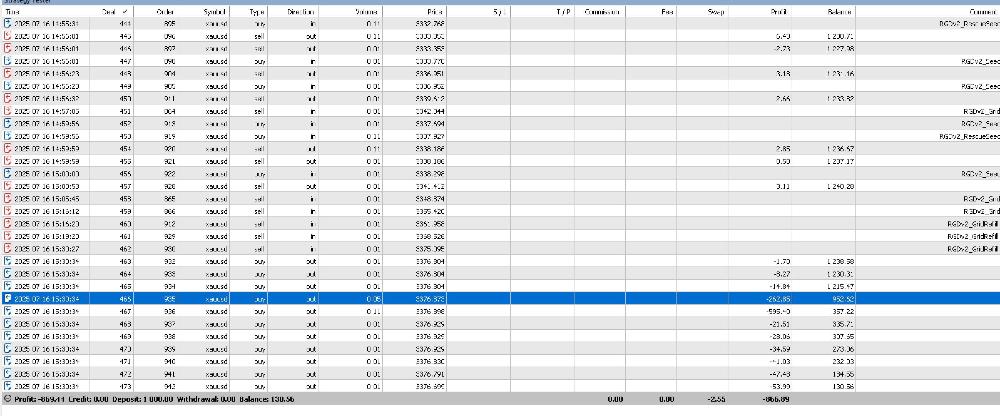
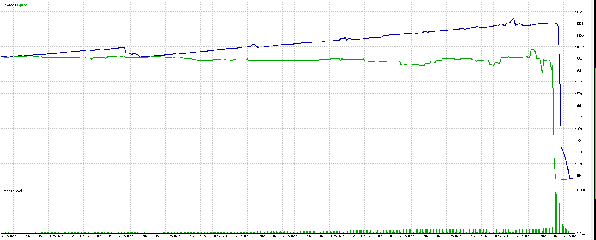

ok cảm ơn bạn , mình đã test và thấy ok nhưng mà mình có 1 new feature lớn có 
thể break change cực lớn \
\
 hình này bạn thấy mọi thứ ổn , nhưng đột nhiên bị cháy ví 
\
mình sẽ nói flow tại sao bị cháy theo nhận định của mình nha , có thể ko đúng 
bạn có thể phản bác \
A (sell) B(buy) khi giá sideway ví tăng rất ok , cho tới khi news hay gì đó 
khiến giá giảm xuống , A đã chốt lời và đợi rescue B, nhưng giá nó cứ giảm quá 
nhiều chạm 10 (ước lượng tổng 0.3-0.4 lot dựa trên ảnh history) -> A vẫn rescue 
như bình thường, vẫn chạm 5usd (InpTargetCycleUSD) và chốt lời , nhưng cái khó ở
 đây là B cầm nhiều lot và dca cũng ko cứu dc , dẫn tới như 1 bong bóng nổ chậm 
, và tới khi nào đó bong bóng nổ ,cháy tài khoản như trong ảnh 1\
\
\
\
------------------------\
mình ra ý tưởng này , là lifecycle mình sẽ chỉnh lại InpGridLevels = 5-10 (nhỏ 
hơn,hiện tại đang là vô cực levels) -> nhưng giả sử giá giảm giống case trên -> 
chạm full grid thì mình sẽ làm:\
1. ko quản lý lifesysle đó nữa - mình sẽ đặt SL cho lifesysle , giống như 1 job 
có 1 ví tiền \
2. sẽ open 1 job mới để kiếm tiền ở sideway tại giá current \
3. giả sử job thứ 2 cũng bị giống job 1 thì open job thứ 3 cứ thế mà job n \\
\
---- tại sao mình muốn làm như vậy:\\
tại mình cứ depend và chờ đợi job 1 hoà vốn , rescue ko thể cứu cả đời dc -> sẽ 
ảnh hưởng việc kiếm tiền của dự án , và làm cho bong bóng nổ chậm nếu grid to mà
 giá vẫn giảm mạnh \
- job mới sẽ kiếm tiền như start EA -> ko cần quan tâm job 1 bị gì , chính mình 
làm việc mình\
\
\
===== độ khó ==============\\
- độ khó maximun vì 1 job A dễ bị manage job B  khác, bị depend vô nhanh \
- cần tạo ra 1 magic group riêng cho 1 job\
- cần biết stats của mỗi job \
- main(điều hướng) -> phải detect khi nào job A bị ngợp (lố grid/đang TSL) -> 
thì điều hướng new 1 job B \
- 2 loại dừng của job:  SL cho job A hoặc làm 1 dạng DD, nếu % DD của ví >= job 
A (ok bỏ job A vì job B job C cứu ko nỗi) 